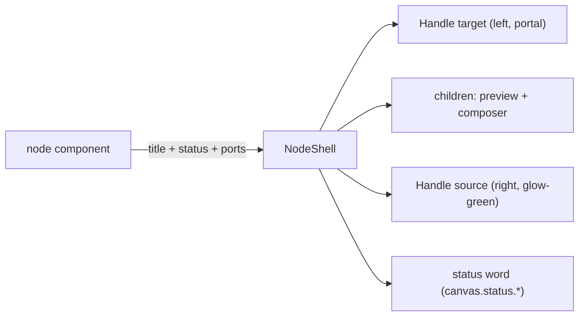

# NodeShell.tsx — AI component doc

> AI-facing sidecar for `NodeShell.tsx`. Created 2026-07-29. Keep this in sync with the code on every change.

## Purpose
The shared chrome every canvas node wears: an opaque steel card whose border and header word both report the node's run status, plus the React Flow `Handle`s that make it wirable. Nodes are ordinary DOM (ADR canvas-mode D4), so this is a styled wrapper — it renders no node-specific behaviour.

## What it does (for an AI reader)
- Responsibilities: card surface, status border + status word (+ live progress %), input/output ports.
- Public API / exports / props / endpoints: `NodeShell`, `NodeShellProps` = `{ title, status: NodeRunStatus, progress?: number | null, hasInput: boolean, hasOutput: boolean, children }`. `progress` defaults to `null` and is ignored for every status except `'processing'`.
- Inputs → Outputs: a localized kind label + a status (+ optional progress) → a 288px card with `Handle`s and the caller's body inside.
- Side effects (I/O, network, state): none; `useTranslation` for the status word only.

## Dependencies
- Imports / depends on: `@xyflow/react` (`Handle`, `Position`), `react-i18next`, `NodeRunStatus` from `../model/types`.
- Used by: `ImageNode` (and `VideoNode` through it), `UploadNode`. `NoteNode` deliberately does NOT use it.

## Diagram

## Key decisions / gotchas
- OPAQUE steel, not the glass `Card` primitive: a node floats over a textured dot canvas with wires and media behind it — the same readability argument that keeps `Select`'s popup opaque (design.md §3.5). Glass would also fight the status border, because the frosted recipe ships its own border-color utilities and Tailwind resolves competing ones by stylesheet order, not class order.
- Status is never color-only (a11y law §8): `STATUS_BORDER` and the header word always change together, and the word is the localized `canvas.status.<status>` key.
- `hasOutput={false}` is how video stays terminal — the port simply does not exist, so an illegal wire cannot even be started (edgeRules refuses it too; two independent guards).
- Handle colors use the `!` important prefix because React Flow's own `.react-flow__handle` background wins otherwise. That is a vendor override, not a bespoke design token.
- `rounded-2xl` per the card radius law; media plates inside stay `rounded-lg`.
- **I5 fix-wave addition.** The status word now appends `· {progress}%` while `status === 'processing'` and `progress !== null` — mirrors `Cinema/components/ShotClipStatus.tsx`. `ImageNode.tsx` is the only caller that passes a live `progress` today (from `Generation.progress`); every other caller relies on the `= null` default and sees no change.

## Commits
- f7268e3 2026-07-30 feat(canvas-web): node components — image/video/upload/note, version strip
- (fix-wave) fix(canvas): I5 — NodeShell shows live progress % next to the processing status word
