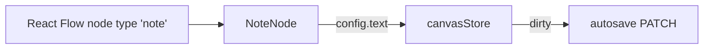

# NoteNode.tsx — AI component doc

> AI-facing sidecar for `NoteNode.tsx`. Created 2026-07-29. Keep this in sync with the code on every change.

## Purpose
The sticky note: free text pinned to the board, no ports, never runs. It is how a user annotates a chain ("try this with the colder palette") without inventing a node that costs money.

## What it does (for an AI reader)
- Responsibilities: render a textarea bound to `config.text` and write every keystroke into the store.
- Public API / exports / props / endpoints: `NoteNode({ id })` — registered as React Flow node type `note`.
- Inputs → Outputs: node id → an amber sticky; typing → `updateNodeConfig(id, { text })` → dirty → autosave.
- Side effects (I/O, network, state): store writes only.

## Dependencies
- Imports / depends on: `react-i18next`, `../model/canvasStore`.
- Used by: `CanvasEditor`'s `nodeTypes` map.

## Diagram

## Key decisions / gotchas
- Skips `NodeShell` deliberately: a note has no run status and no handles, so the shared chrome would contribute only a status border it must not have. `edgeRules` independently refuses `note` in either wire role.
- Amber tint (`specimen-amber/20` + `/40` border) places it in the triad's "explore / aside" role, so it reads as annotation rather than as a generator block.
- `narrower (w-56) than a generation node` on purpose — a sticky that matches a composer in size competes with it for attention.
- `nodrag` on the textarea; without it React Flow pans the canvas when the user drags to select text.
- The textarea has an `aria-label` because a sticky has no visible label — placeholder-only fields are not accessible names.

## Commits
- _no commit yet_
