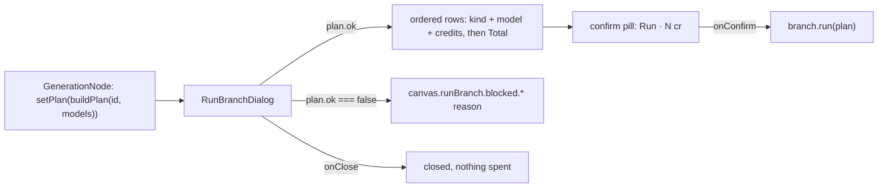

# RunBranchDialog.tsx — AI component doc

> AI-facing sidecar for `RunBranchDialog.tsx`. Created 2026-07-30. Keep this in sync with the code on every change.

## Purpose
The confirm gate for a branch run (ADR `canvas-mode` D5 — "spend stays explicit"). A branch can charge for several generations from ONE click, which makes it the only action on the board allowed to interrupt: the user sees every run that is about to happen, which model does it, what each costs and the total, then answers.

## What it does (for an AI reader)
- Responsibilities: render a `BranchPlan` as an ordered, priced list; restate the total on the confirm pill; disable the confirm when the plan is unpriceable; state the blocker instead of offering a run when the plan cannot execute.
- Public API / props: `RunBranchDialog({ isOpen, plan, onClose, onConfirm })`.
- Inputs → Outputs: a plan → a blocking dialog; the user's answer → `onConfirm()` (the caller closes, then runs) or `onClose()`.
- Side effects: none. It neither plans nor runs — no graph, no catalog, no network, no store.

## Dependencies
- Imports / depends on: `react-i18next`, `shared/ui` (`Button`, `Modal`), and the `BranchPlan` TYPE from `../model/useRunBranch`.
- Used by: `GenerationNode` (in `ImageNode.tsx`), which owns the open/closed state and the plan it was opened with.

## Diagram

## Key decisions / gotchas
- `role="alertdialog"`, like the Assets3D spend gate: a credit is not undoable, so the moment is deliberately blocking and a screen reader should say so.
- **It renders a plan, it never builds one.** Planning is pure and lives in `useRunBranch`; keeping this component ignorant of graphs, statuses and the catalog is what makes both halves testable in isolation.
- **The number is said TWICE** — once in the Total row, once ON the confirm pill the click is aimed at. That repetition is the whole point of the gate (the `SpendConfirmModal` precedent).
- An `<ol>`, not a `<ul>`: the ORDER is part of what is being confirmed. These runs happen one after another and a mid-branch failure stops the rest, so the numbering is information, not decoration.
- Each row names the MODEL. A row reading only "Image · 8 cr" hides the choice that actually spends the credits.
- `total === null` (some node's model is missing from the catalog — a stale document) → the pill falls back to the plain CTA label and is DISABLED. There is no honest price to print, and a dialog is the last place to invent one.
- A blocked plan shows `canvas.runBranch.blocked.{reason}` and NO run button. A disabled button with no explanation is a dead end; the reason names what to fix.
- Cancel is the quiet `ghost` pill: backing out of a spend is never the action the design should nudge toward or away from.
- The caller closes BEFORE running (`onConfirm` then `setPlan(null)`): a modal hanging over a running board hides the progress it just caused.

## Commits
- cfd1df7 2026-07-30 feat(canvas-web): run branch — toposorted queue behind one confirmed spend
