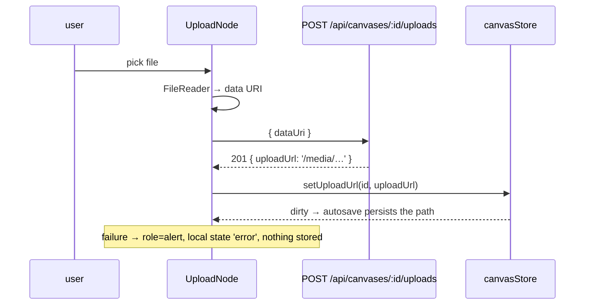

# UploadNode.tsx — AI component doc

> AI-facing sidecar for `UploadNode.tsx`. Created 2026-07-29. Keep this in sync with the code on every change.

## Purpose
The upload node: a user's own image on the board. It reads the file locally, POSTs it as a data URI to `/api/canvases/:id/uploads`, and stores the server-minted `/media/…` path on the node. No generation, no charge.

## What it does (for an AI reader)
- Responsibilities: file picking, data-URI conversion, upload, local upload status, preview.
- Public API / exports / props / endpoints: `UploadNode({ id })` — React Flow node type `upload`; calls `POST /api/canvases/:id/uploads`.
- Inputs → Outputs: a picked `File` → `{ uploadUrl }` → `setUploadUrl(id, url)` → the next autosave persists it.
- Side effects (I/O, network, state): `FileReader`, one HTTP POST, store write, local `state` for idle/uploading/error.

## Dependencies
- Imports / depends on: `react`, `react-i18next`, `WELL_SURFACE` from `shared/ui`, `../model/canvasStore`, `uploadCanvasImage` from `../model/api`, `./NodeShell`.
- Used by: `CanvasEditor`'s `nodeTypes` map.

## Diagram

## Key decisions / gotchas
- The bytes never enter the document: the server stores the file and returns a path, and the contract enforces the `/media/` prefix at PATCH, so a node can never carry an arbitrary URL.
- The server re-guards raster-only MIME and size — the `accept` attribute is convenience, not a security boundary (a data URI is trivially forged).
- Upload state is LOCAL, not in the store: an in-flight upload is not part of the saved document, and putting it there would mark the canvas dirty for no persisted change.
- `e.target.value = ''` after handling — otherwise re-picking the SAME file fires no change event and the upload silently does nothing.
- The node's status is derived (`uploadUrl ? 'succeeded' : 'idle'`), so a filled upload gets the same green border language as a finished generation.
- `hasInput={false}`: an upload is a source only. It IS wirable downstream, but `buildRunInput` skips upload parents in this phase — a stored file has no generation id to cite (phase 4's operation nodes give it one).

## Commits
- f7268e3 2026-07-30 feat(canvas-web): node components — image/video/upload/note, version strip
