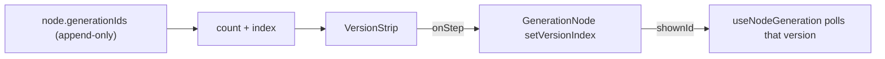

# VersionStrip.tsx — AI component doc

> AI-facing sidecar for `VersionStrip.tsx`. Created 2026-07-29. Keep this in sync with the code on every change.

## Purpose
The version stepper on a generation node. Regenerating APPENDS to `generationIds`, so a node keeps every run the user paid for; this strip is how they walk back through them ("v2 / 3").

## What it does (for an AI reader)
- Responsibilities: render the current position, and two prev/next buttons that ask the parent to move.
- Public API / exports / props / endpoints: `VersionStrip`, `VersionStripProps` = `{ count: number; index: number; onStep: (nextIndex: number) => void }`.
- Inputs → Outputs: history length + shown index → a compact controlled stepper; clicks call `onStep`.
- Side effects (I/O, network, state): none — fully controlled.

## Dependencies
- Imports / depends on: `react-i18next`.
- Used by: `ImageNode`/`GenerationNode` (and therefore `VideoNode`).

## Diagram

## Key decisions / gotchas
- Renders `null` below two versions: one run is not a history, and an inert stepper would only add noise to a 288px card.
- CONTROLLED on purpose — the same index also selects which generation the node polls, so the parent must own it. Owning it locally would let the preview and the poll disagree.
- The arrows are `aria-hidden` glyphs; the buttons carry real `aria-label`s (`canvas.node.prevVersion` / `nextVersion`), per the icon-button a11y rule.
- `nodrag` on both buttons — without it React Flow starts a canvas drag from the click.

## Commits
- f7268e3 2026-07-30 feat(canvas-web): node components — image/video/upload/note, version strip
