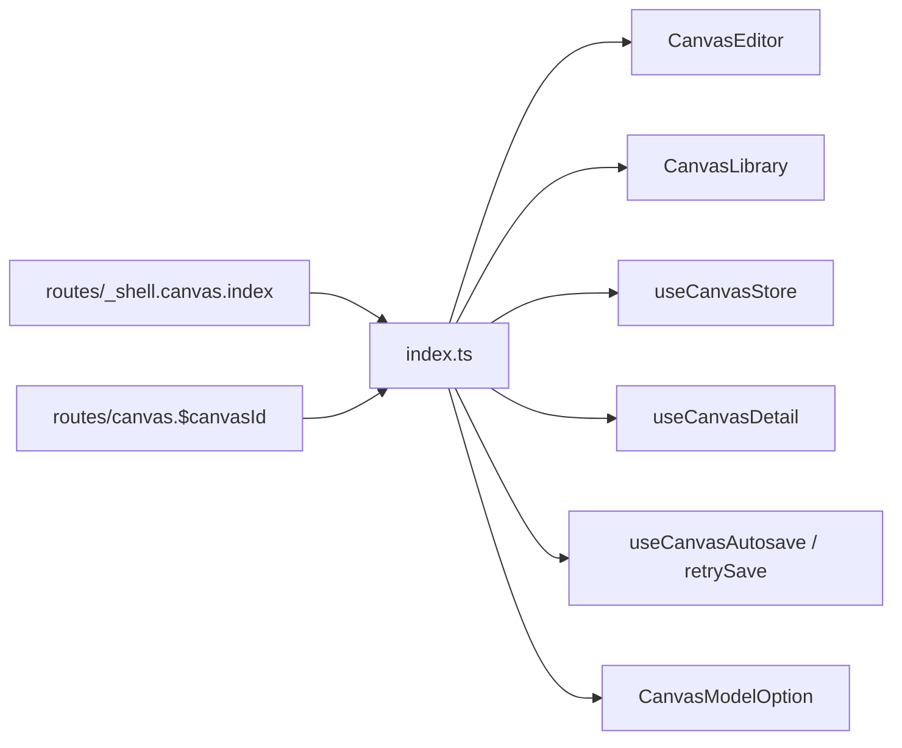

# index.ts — AI component doc

> AI-facing sidecar for `index.ts`. Created 2026-07-30. Keep this in sync with the code on every change.

## Purpose
The public API of the Canvas module. Routes compose through these six exports and nothing else; the store internals, edge rules, run hooks and node components stay private so the editor keeps ownership of its document lifecycle.

## What it does (for an AI reader)
- Responsibilities: publish the module surface; keep everything else unreachable from outside.
- Public API / exports / props / endpoints: `CanvasEditor`, `CanvasLibrary`, `useCanvasStore`, `useCanvasDetail`, `useCanvasAutosave`, `retrySave`, type `CanvasModelOption`.
- Inputs → Outputs: n/a — a barrel.
- Side effects (I/O, network, state): none.

## Dependencies
- Imports / depends on: `./components/CanvasEditor`, `./components/CanvasLibrary`, `./model/canvasStore`, `./model/api`, `./model/useCanvasDoc`, `./model/types`.
- Used by: `routes/_shell.canvas.index.tsx`, `routes/canvas.$canvasId.tsx`.

## Diagram

## Key decisions / gotchas
- The module imports NOTHING from `modules/Generator` or `modules/Cinema` (their composer pieces are private). The catalog a node picker needs flows through the ROUTE seam as `CanvasModelOption[]`, which is exactly why that type is exported.
- `useCanvasStore` is public even though it is internal machinery: the route owns the per-document lifecycle (`init` on load, `reset` on leave) and renders the title + save status in its own header, and the store is the only honest source for both.
- `buildRunInput`, `useRunNode`, `canConnect` and the node components stay unexported — a route composing those would be building a second editor.

## Commits
- _no commit yet_
