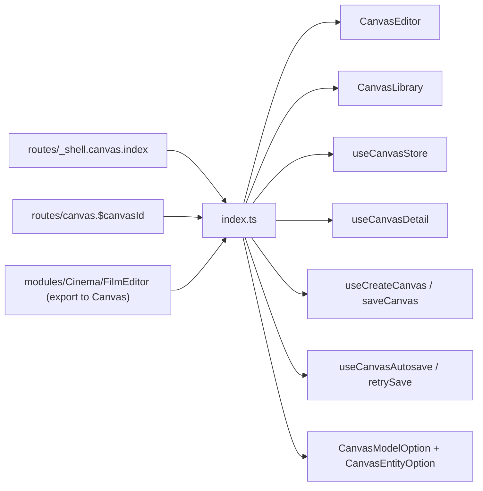

# index.ts — AI component doc

> AI-facing sidecar for `index.ts`. Created 2026-07-30. Keep this in sync with the code on every change.

## Purpose
The public API of the Canvas module. Routes compose through these exports and nothing else; the store internals, edge rules, run hooks and node components stay private so the editor keeps ownership of its document lifecycle.

## What it does (for an AI reader)
- Responsibilities: publish the module surface; keep everything else unreachable from outside.
- Public API / exports / props / endpoints: `CanvasEditor`, `CanvasLibrary`, `useCanvasStore`, `useCanvasDetail`, `useCreateCanvas`, `saveCanvas`, `useCanvasAutosave`, `retrySave`, types `CanvasModelOption` + `CanvasEntityOption`.
- Inputs → Outputs: n/a — a barrel.
- Side effects (I/O, network, state): none.

## Dependencies
- Imports / depends on: `./components/CanvasEditor`, `./components/CanvasLibrary`, `./model/canvasStore`, `./model/api`, `./model/useCanvasDoc`, `./model/types`.
- Used by: `routes/_shell.canvas.index.tsx`, `routes/canvas.$canvasId.tsx`, `modules/Cinema/components/FilmEditor.tsx` (`useCreateCanvas` + `saveCanvas`, the "Export to Canvas" one-off conversion — the ONE approved exception to "modules never import each other").

## Diagram

## Key decisions / gotchas
- The module imports NOTHING from `modules/Generator`, `modules/Cinema` or `modules/Entities`. The catalog a node picker needs flows through the ROUTE seam as `CanvasModelOption[]`, and the Soul characters a character node picks from as `CanvasEntityOption[]` — which is exactly why both types are exported.
- `useCanvasStore` is public even though it is internal machinery: the route owns the per-document lifecycle (`init` on load, `reset` on leave) and renders the title + save status in its own header, and the store is the only honest source for both.
- `useCreateCanvas`/`saveCanvas` are exported so `modules/Cinema` can build+persist a ONE-OFF canvas from a finished film (Export to Canvas, 2026-08-04) without going through the store/editor lifecycle at all — the module boundary bends ONE way here (Cinema → Canvas), never the reverse.
- `buildRunInput`, `useRunNode`, `canConnect` and the node components stay unexported — a route composing those would be building a second editor.

## Commits
- bcb3148 2026-07-30 feat(canvas-web): editor shell, palette, library, routes
- 87c6d3c 2026-07-30 feat(canvas-web): character node — a Soul character as a wired reference
