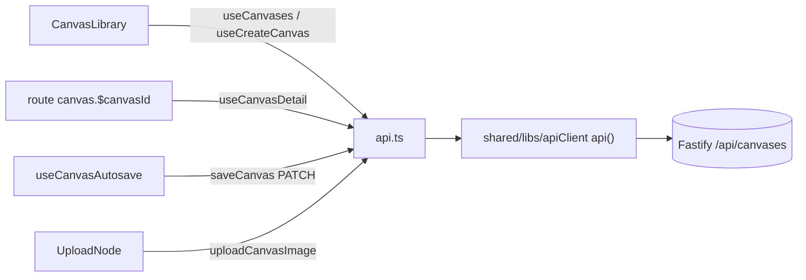

# api.ts — AI component doc

> AI-facing sidecar for `api.ts`. Created 2026-07-29. Keep this in sync with the code on every change.

## Purpose
Every `/api/canvases` call the Canvas module makes, in one file: the list/detail queries, the create/delete mutations, the raw autosave PATCH, and the upload-node POST. Nothing else in the module touches `fetch` — errors decode once in `shared/libs/apiClient` and arrive as `ApiClientError`.

## What it does (for an AI reader)
- Responsibilities: type the four canvas endpoints against the shared contracts and own the query keys.
- Public API / exports / props / endpoints:
  - `useCanvases()` → `GET /api/canvases`, key `['canvases']`.
  - `useCanvasDetail(id)` → `GET /api/canvases/:id`, key `['canvas', id]`, `staleTime: Infinity`.
  - `useCreateCanvas()` → `POST /api/canvases` (title) → invalidates `['canvases']`.
  - `useDeleteCanvas()` → `DELETE /api/canvases/:id` (204) → invalidates `['canvases']`.
  - `saveCanvas(id, doc)` → `PATCH /api/canvases/:id` — plain function, not a hook.
  - `uploadCanvasImage(id, dataUri)` → `POST /api/canvases/:id/uploads` → `{ uploadUrl: '/media/…' }`.
- Inputs → Outputs: contract types in (`UpdateCanvasInput`), contract types out (`Canvas`, `CanvasDetail`, `CanvasList`, `CanvasUploadResult`).
- Side effects (I/O, network, state): HTTP + TanStack Query cache writes. No store access.

## Dependencies
- Imports / depends on: `@tanstack/react-query`, contract types from `@opencreate/contracts`, `api` from `shared/libs/apiClient`.
- Used by: `useCanvasDoc.ts` (`saveCanvas`), `components/CanvasLibrary.tsx` (`useCanvases`, `useCreateCanvas`), `components/UploadNode.tsx` (`uploadCanvasImage`), `routes/canvas.$canvasId.tsx` via the module barrel (`useCanvasDetail`), and — via the barrel's one cross-module exception — `modules/Cinema/components/FilmEditor.tsx` (`useCreateCanvas` + `saveCanvas`, Export to Canvas).

## Diagram

## Key decisions / gotchas
- `saveCanvas` is deliberately NOT a mutation hook: the autosave loop runs off a Zustand `subscribe` outside React's render cycle, so it needs a callable, not a hook result.
- `useCanvasDetail` uses `staleTime: Infinity` because the STORE owns the document after `init()`. A background refetch would overwrite in-progress edits — i.e. eat keystrokes — so the query is a one-shot loader, not a live mirror.
- The PATCH carries the FULL document (last-write-wins, single-owner). There is no partial/op-based patch endpoint; `UpdateCanvasInput` is all-optional only so a title-only rename stays a one-key body.
- Upload bytes never travel inside the document: the server stores them and answers a `/media/…` path (the contract enforces that prefix at PATCH), which the caller writes into the node.

## Commits
- 3da7615 2026-07-30 feat(canvas-web): api layer + per-document editor store
