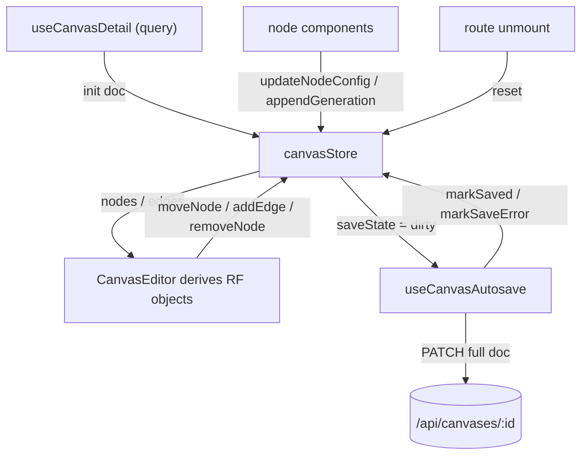

# canvasStore.ts — AI component doc

> AI-facing sidecar for `canvasStore.ts`. Created 2026-07-29. Keep this in sync with the code on every change.

## Purpose
The editing truth for ONE open canvas: the working document (title, viewport, nodes, edges) plus a save status. Server truth lives in TanStack Query; this store holds exactly what the server has no opinion about between saves. Every node component reads its own row from here by id, and every mutating action flips `saveState` to `'dirty'`, which is the single signal the autosave loop watches.

## What it does (for an AI reader)
- Responsibilities: hold the document, expose typed edit actions, and track save status.
- Public API / exports / props / endpoints: `useCanvasStore`, `SaveState`. Actions: `init(doc)`, `reset()`, `setTitle`, `setViewport`, `addNode(kind, position)`, `moveNode`, `updateNodeConfig`, `setUploadUrl`, `appendGeneration`, `removeNode`, `addEdge(source, target)`, `removeEdge`, `markSaving`, `markSaved`, `markSaveError`.
- Inputs → Outputs: a loaded `CanvasDetail` in via `init`; a mutable `{title, viewport, nodes, edges}` document out, consumed by the editor for render and by `useCanvasDoc` as the PATCH body.
- Side effects (I/O, network, state): in-memory state only — no network, no persistence. Ids are minted with `crypto.randomUUID()`.

## Dependencies
- Imports / depends on: `zustand`, contract types from `@opencreate/contracts`.
- Used by: `useCanvasDoc.ts` (reads the doc, flips save flags), `useNodeGeneration.ts` (`appendGeneration` on submit), every node component (`ImageNode`/`VideoNode`/`UploadNode`/`NoteNode`), `CanvasEditor.tsx` (derives React Flow objects, writes back changes), `routes/canvas.$canvasId.tsx` (init/reset lifecycle + title/saveState in the header).

## Diagram

## Key decisions / gotchas
- SINGLETON + `init()`/`reset()`, not a store factory — the `wizardStore` precedent. The route resets on unmount so one canvas's nodes can never leak into the next; the store is a module singleton, the route param is not.
- `removeNode` drops the node and its EDGES, never its children's `generationIds`: a downstream node cites generation ids directly, so deleting the parent must not erase the clip the user already paid for.
- `generationIds` is append-only (`appendGeneration`) — that list IS the version history the `VersionStrip` steps through; overwriting it would silently discard paid runs.
- `markSaved` is conditional: it only clears `'saving'`/`'dirty'`. An edit that lands while a PATCH is in flight leaves the state dirty, so the loop saves again instead of losing the change.
- Node ids are 8 hex chars from `crypto.randomUUID()` — unique within a canvas is all the contract requires (`z.string().min(1).max(40)`), and short ids keep the full-document PATCH small.
- `INITIAL` is spread on `reset()` so the nodes/edges arrays are fresh objects; sharing the array identity across resets would let a stale render mutate the next document.

## Commits
- 3da7615 2026-07-30 feat(canvas-web): api layer + per-document editor store
