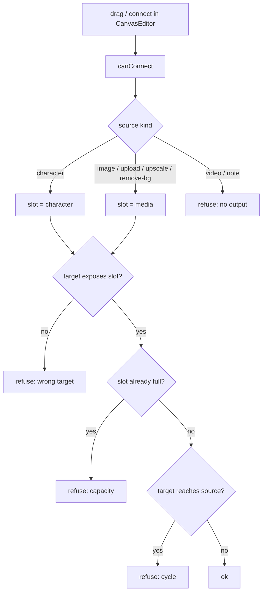

# edgeRules.ts — AI component doc

> AI-facing sidecar for `edgeRules.ts`. Created 2026-07-29. Keep this in sync with the code on every change.

## Purpose
The whole connection law of the canvas graph in one pure function. `canConnect()` answers "may this wire exist?" for a candidate source/target pair, given the current nodes and edges. It runs twice — while the user drags (React Flow's `isValidConnection`, so an illegal wire never even snaps) and again in `onConnect` — which means the stored document can never contain an edge this file would refuse, and everything downstream (run submission, phase-3 toposort) may trust the graph shape instead of re-checking it.

## What it does (for an AI reader)
- Responsibilities: classify the wire's SLOT from the source kind (media vs character), check the target exposes that slot, enforce per-slot capacity, reject duplicates, self-loops and cycles.
- Public API / exports / props / endpoints: `canConnect(sourceId, targetId, nodes, edges) => { ok: true } | { ok: false, reason: string }`.
- Inputs → Outputs: two node ids + `readonly {id, kind}[]` + `readonly CanvasEdge[]` → a verdict carrying a human-readable refusal reason.
- Side effects (I/O, network, state): none — no store reads, no DOM, no I/O. Fully unit-testable (`edgeRules.test.ts`, 11 cases).

## Dependencies
- Imports / depends on: `CanvasEdge`/`CanvasNodeKind` from `@opencreate/contracts`, `MEDIA_SOURCE_KINDS` from `./types`.
- Used by: `components/CanvasEditor.tsx` (`isValidConnection` + `onConnect`).

## Diagram

## Key decisions / gotchas
- TWO independent slots per target, not one input list: an image/video node may hold one media parent AND one character at once, so capacity is counted per slot (`MEDIA_INPUT_CAP` / `CHARACTER_INPUT_CAP`). A kind missing from a table has no socket of that type at all — that is how `upscale` refuses characters and `character`/`note` refuse everything.
- `video` is a legal TARGET but never a SOURCE: a clip cannot feed i2i or i2v, so video is terminal in the MVP. It is absent from `MEDIA_SOURCE_KINDS` rather than special-cased here.
- Cycle detection walks forward from the TARGET; reaching the source means the new edge would close a loop. The tables are phase-3/4-ready (`upscale`/`remove-bg`/`character` already legal), so later phases add node behaviour, not graph law.
- Refusals return a `reason` string. Phase 2 only reads `.ok` (the wire simply does not snap — the standard React Flow affordance); the reason exists for the tooltip/toast a later phase can add without changing this signature.
- The DFS pops with an explicit `undefined` guard instead of `!` — the repo bans non-null assertions, and `stack.pop()` is typed optional even inside a `length > 0` loop.

## Commits
- _no commit yet_
