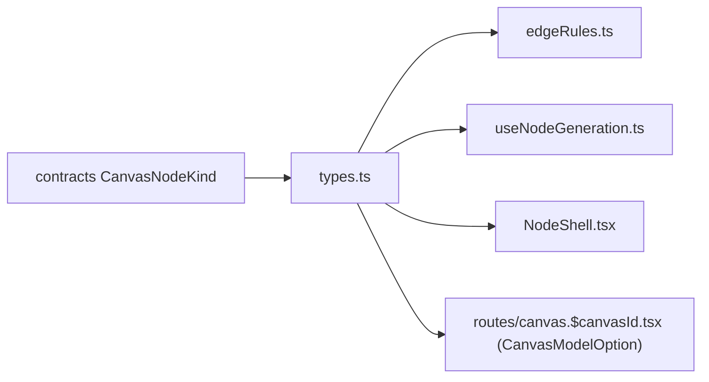

# types.ts — AI component doc

> AI-facing sidecar for `types.ts`. Created 2026-07-29. Keep this in sync with the code on every change.

## Purpose
Editor-side vocabulary for the Canvas module (ADR `canvas-mode`, phase 2): the run-status union that paints node borders, the catalog subset a node composer needs, and the two node-kind sets the graph law is written against. Everything document-shaped (`CanvasNode`, `CanvasEdge`, `CanvasNodeConfig`) comes from `@opencreate/contracts` instead — this file only adds what the wire has no opinion about.

## What it does (for an AI reader)
- Responsibilities: name the four run states; describe a model as a node picker sees it; declare which kinds may source / accept a media wire.
- Public API / exports: `NodeRunStatus`, `CanvasModelOption`, `MEDIA_SOURCE_KINDS`, `MEDIA_TARGET_KINDS`.
- Inputs → Outputs: pure type/constant module — no runtime behaviour beyond the two frozen-by-convention arrays.
- Side effects: none.

## Dependencies
- Imports / depends on: `CanvasNodeKind` from `@opencreate/contracts`.
- Used by: `edgeRules.ts` (source-kind check), `useNodeGeneration.ts` (media-parent lookup), `ImageNode`/`VideoNode` (`CanvasModelOption`), `NodeShell` (`NodeRunStatus`), and the module barrel (re-exports `CanvasModelOption` so the route can shape the catalog).

## Diagram

## Key decisions / gotchas
- `CanvasModelOption` is a NARROWED copy of `CatalogModel`, not a re-export: the Canvas module may not import `modules/Generator`, so the route maps the catalog into this shape and passes it down as React Flow node data. Video pricing is per-duration on the wire; the option carries one flat `credits` number the node chip shows.
- `MEDIA_SOURCE_KINDS` deliberately omits `video`: video is TERMINAL in the MVP (nothing downstream can consume a clip — i2i and i2v both need a still).
- `upload` IS a media source for the graph (you may wire it), but `buildRunInput` still refuses to cite it as a chain input: an upload is a stored file, not a generation, so there is no `inputGenerationId` for it until phase 4's operation nodes.
- `character` is absent from both lists on purpose — it travels the separate entity slot in `edgeRules.ts`.

## Commits
- _no commit yet_
