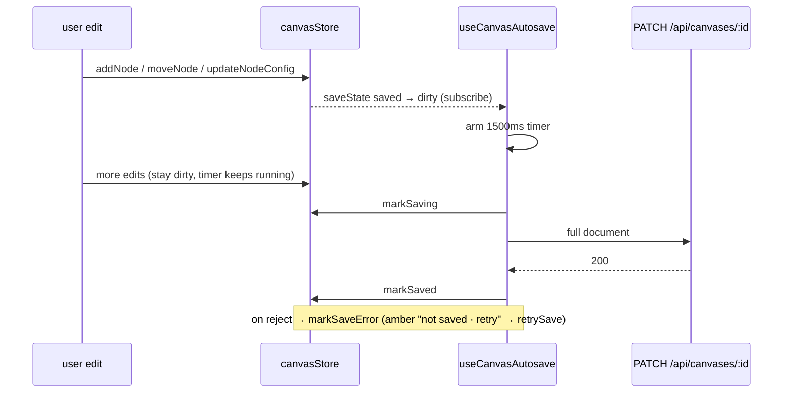

# useCanvasDoc.ts — AI component doc

> AI-facing sidecar for `useCanvasDoc.ts`. Created 2026-07-29. Keep this in sync with the code on every change.

## Purpose
The canvas autosave loop — the first debounced autosave in this codebase (everywhere else a save is an explicit button). A node editor mutates on every drag, keystroke and wire, so the editor watches the store's dirty flag, waits for 1.5 s of quiet, and PATCHes the whole document. The route mounts it once; nothing else in the app persists canvas state.

## What it does (for an AI reader)
- Responsibilities: debounce dirty→save, own the in-flight/error status transitions, flush a pending save on unmount, and expose a manual retry.
- Public API / exports / props / endpoints: `useCanvasAutosave()` (mount-once hook, returns nothing), `retrySave()` (imperative, for the header's "not saved · retry"), `AUTOSAVE_DEBOUNCE_MS = 1500`.
- Inputs → Outputs: reads `{title, viewport, nodes, edges}` from `canvasStore` → `PATCH /api/canvases/:id` via `saveCanvas` → writes `saveState` back to the store (`saving` → `saved` | `error`).
- Side effects (I/O, network, state): network PATCH, a `setTimeout` timer, and a Zustand `subscribe` subscription — all torn down by the effect cleanup.

## Dependencies
- Imports / depends on: `react` (`useEffect`), `./canvasStore`, `saveCanvas` from `./api`.
- Used by: `routes/canvas.$canvasId.tsx` (mounts `useCanvasAutosave`, renders the status and wires `retrySave`), re-exported from `modules/Canvas/index.ts`.

## Diagram

## Key decisions / gotchas
- The subscriber re-arms ONLY on the transition into `'dirty'` (`prev.saveState === 'dirty'` returns early). Edits while already dirty ride the armed timer, so two rapid edits are one PATCH — this is exactly what the first test pins.
- It subscribes instead of selecting state in React: the loop must not re-render the editor on every keystroke, and it needs the previous value to detect the transition.
- `flush()` reads the store with `getState()` at call time, never from a closure — the snapshot must be the document as of the save, not as of the arming edit.
- `flush()` also runs when `saveState === 'error'`, which is what makes `retrySave()` work without duplicating the request logic.
- Unmount flushes synchronously-ish (fire-and-forget promise): navigating away mid-edit loses at most the debounce window, and a lost response is harmless because the next open re-loads whatever the server accepted.
- A failed PATCH never touches the document — local state is authoritative until a save succeeds, so an offline blip cannot erase nodes.

## Commits
- _no commit yet_
