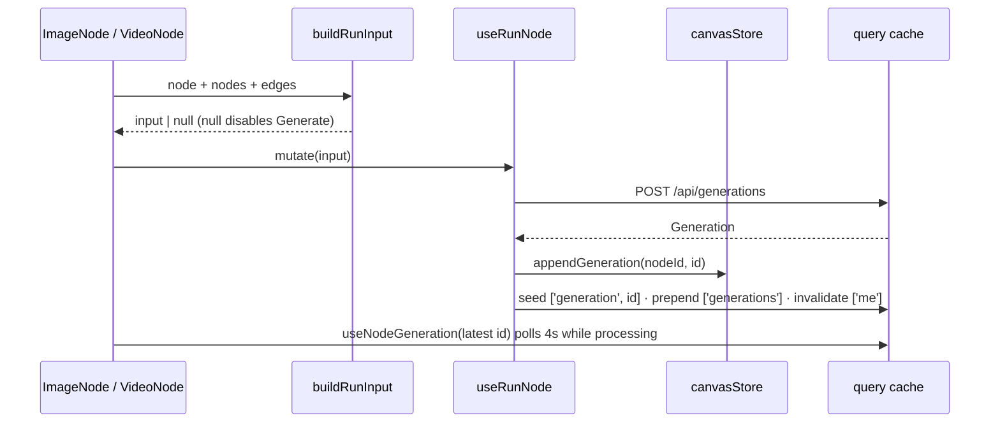

# useNodeGeneration.ts — AI component doc

> AI-facing sidecar for `useNodeGeneration.ts`. Created 2026-07-29. Keep this in sync with the code on every change.

## Purpose
Turns one canvas node into a real generation: `buildRunInput` reads the node's config and its incoming wires into a `POST /api/generations` body, `useRunNode` submits it and appends the id to the node's version history, and `useNodeGeneration` polls that id to a terminal state. There is NO canvas-specific run endpoint — a node run is an ordinary generation, which is what keeps money, refunds and the Library feed unchanged (ADR canvas-mode D1).

## What it does (for an AI reader)
- Responsibilities: compose the request, gate un-runnable nodes, submit with a transient-only retry policy, seed/refresh the shared caches, poll while processing.
- Public API / exports / props / endpoints:
  - `findMediaParent(nodeId, nodes, edges) => CanvasNode | undefined` (pure) — the shared parent-lookup, factored out so `buildRunInput` and the node components (which also poll the parent's latest id for cache freshness) can never disagree on what counts as the media parent.
  - `buildRunInput(node, nodes, edges, generationStatus = {}) => CreateGenerationInput | null` (pure). `generationStatus` is a `Record<id, Generation['status'] | undefined>` snapshot the CALLER reads out of the shared query cache.
  - `useRunNode(nodeId)` → mutation over `POST /api/generations`.
  - `useNodeGeneration(generationId | null)` → query over `GET /api/generations/:id`, key `['generation', id]`, 4 s interval while `processing`.
- Inputs → Outputs: a `CanvasNode` + the graph → a generation request; a generation id → its live `Generation`.
- Side effects (I/O, network, state): HTTP; `canvasStore.appendGeneration`; cache writes to `['generation', id]` and `['generations']`; invalidates `['me']` (balance).

## Dependencies
- Imports / depends on: `@tanstack/react-query`, contract types, `api`/`ApiClientError` from `shared/libs/apiClient`, `./canvasStore`, `MEDIA_SOURCE_KINDS` from `./types`.
- Used by: `components/ImageNode.tsx` (and `VideoNode` through it) — the only consumers; the editor never runs nodes itself.

## Diagram

## Key decisions / gotchas
- The chain edge sends `inputGenerationId`, never image bytes: the SERVER resolves its own stored media. For an image model that citation is merged into the `referenceImages` channel and therefore COUNTS against the model's `referenceMode`/`maxReferenceImages` gate (image models have no `inputImage` path at all); for a video model it becomes the provider seed frame. Do not "simplify" the request shape on that assumption.
- **C2 fix-wave correction.** The FIRST version cited `generationIds[length-1]` with no status check — a child could cite a still-processing or a FAILED parent, sending a broken/empty reference into the provider call. `buildRunInput` now walks the parent's history from the newest entry and picks the first id whose `generationStatus[id] === 'succeeded'`; if none is, it returns `null` (Generate stays disabled). This is why the function grew a 4th parameter instead of reaching into the query cache itself — it stays pure and unit-testable with a plain object, and the CALLER (`ImageNode.tsx`) owns the cache read.
- A parent with no succeeded generation anywhere in its history — empty, still processing, or every attempt failed — returns `null`. The Generate button disables rather than submitting a chain into nothing.
- **F4 fix-wave correction.** `findMediaParent` used to exclude `'upload'` from its match even though `MEDIA_SOURCE_KINDS` includes it — so a node wired to an upload got `mediaParent === undefined`, the SAME result as an unwired node, and `buildRunInput` fell through to a plain t2i/t2v with no error and no disabled button. That charged the user for a run that silently ignored a wire they could see on the board. `findMediaParent` now matches uploads like any other media-kind parent, and `buildRunInput` explicitly returns `null` when `mediaParent.kind === 'upload'` — Generate disables with the exact same affordance as "connected but not yet succeeded". `edgeRules.ts` is untouched: the wire stays legal, it just isn't citable yet. Upload citation itself (turning the wire into a real `inputGenerationId`-equivalent) is phase 4's job.
- Retry is SUBMIT-only and allowlisted (5xx / rate_limited / provider_error / internal_error, max 2). A validation or insufficient-credits failure is final; retrying it would only re-cost the user. A bare network throw is NOT retried here — unlike Cinema's shot submit — because a dropped response may already have been charged.
- The poll key is `['generation', id ?? '']`, byte-identical to Cinema's `useShotGeneration`, so a generation open in the canvas and in the Library shares one cache entry and one interval.
- `appendGeneration` marks the store dirty, so a run is persisted by the ordinary autosave — no special save path for runs.

## Commits
- 5443372 2026-07-30 feat(canvas-web): node run submit + shared-cache polling
- 505a544 2026-07-30 fix(canvas): buildRunInput cites the newest SUCCEEDED parent (C2)
- (fix-wave) fix(canvas): F4 — a wired upload parent disables Generate instead of silently running a plain t2i/t2v
