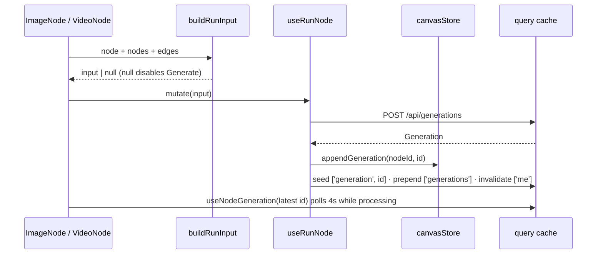

# useNodeGeneration.ts — AI component doc

> AI-facing sidecar for `useNodeGeneration.ts`. Created 2026-07-29. Keep this in sync with the code on every change.

## Purpose
Turns one canvas node into a real generation: `buildRunInput` reads the node's config and its incoming wires into a `POST /api/generations` body, `useRunNode` submits it and appends the id to the node's version history, and `useNodeGeneration` polls that id to a terminal state. There is NO canvas-specific run endpoint — a node run is an ordinary generation, which is what keeps money, refunds and the Library feed unchanged (ADR canvas-mode D1).

## What it does (for an AI reader)
- Responsibilities: compose the request, gate un-runnable nodes, submit with a transient-only retry policy, seed/refresh the shared caches, poll while processing.
- Public API / exports / props / endpoints:
  - `buildRunInput(node, nodes, edges) => CreateGenerationInput | null` (pure).
  - `useRunNode(nodeId)` → mutation over `POST /api/generations`.
  - `useNodeGeneration(generationId | null)` → query over `GET /api/generations/:id`, key `['generation', id]`, 4 s interval while `processing`.
- Inputs → Outputs: a `CanvasNode` + the graph → a generation request; a generation id → its live `Generation`.
- Side effects (I/O, network, state): HTTP; `canvasStore.appendGeneration`; cache writes to `['generation', id]` and `['generations']`; invalidates `['me']` (balance).

## Dependencies
- Imports / depends on: `@tanstack/react-query`, contract types, `api`/`ApiClientError` from `shared/libs/apiClient`, `./canvasStore`, `MEDIA_SOURCE_KINDS` from `./types`.
- Used by: `components/ImageNode.tsx` (and `VideoNode` through it) — the only consumers; the editor never runs nodes itself.

## Diagram

## Key decisions / gotchas
- The chain edge sends `inputGenerationId`, never image bytes: the SERVER resolves its own stored media. For an image model that citation is merged into the `referenceImages` channel and therefore COUNTS against the model's `referenceMode`/`maxReferenceImages` gate (image models have no `inputImage` path at all); for a video model it becomes the provider seed frame. Do not "simplify" the request shape on that assumption.
- Only the parent's LATEST id is cited, and a parent with an empty history returns `null` — the Generate button disables rather than submitting a chain into nothing.
- Upload parents are skipped on purpose (`n.kind !== 'upload'`): an upload is a stored `/media` file, not a generation, so there is nothing to cite until phase 4's operation nodes give it one.
- Retry is SUBMIT-only and allowlisted (5xx / rate_limited / provider_error / internal_error, max 2). A validation or insufficient-credits failure is final; retrying it would only re-cost the user. A bare network throw is NOT retried here — unlike Cinema's shot submit — because a dropped response may already have been charged.
- The poll key is `['generation', id ?? '']`, byte-identical to Cinema's `useShotGeneration`, so a generation open in the canvas and in the Library shares one cache entry and one interval.
- `appendGeneration` marks the store dirty, so a run is persisted by the ordinary autosave — no special save path for runs.

## Commits
- 5443372 2026-07-30 feat(canvas-web): node run submit + shared-cache polling
