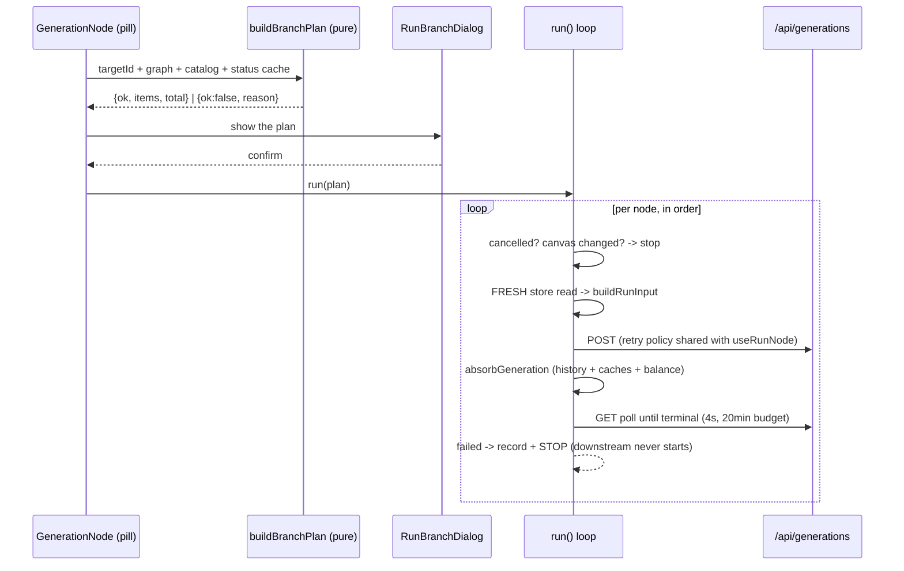

# useRunBranch.ts — AI component doc

> AI-facing sidecar for `useRunBranch.ts`. Created 2026-07-30. Keep this in sync with the code on every change.

## Purpose
"Run branch" — ADR `canvas-mode` D5: execution is CLIENT-ORCHESTRATED and **spend stays explicit**. From one click on a node, the client works out every run that node actually needs, prices the list, asks once, then executes it sequentially. Auto-cascade was rejected in the ADR precisely because one edit must never trigger N unconfirmed charges; this file is that counter-proposal made concrete.

## What it does (for an AI reader)
- Responsibilities: plan (topo-sort + skip + blockers), price, hold the live run state for the whole board, and drive the submit → poll → next loop with an interruption path.
- Public API / exports:
  - `collectBranch(targetId, nodes, edges, generationStatus?) => string[]` (pure) — the runs the target needs, dependencies first, target last.
  - `estimateBranchCredits(nodeIds, nodes, models) => { items, total }` (pure) — itemized cost; `credits` and `total` are `number | null`.
  - `buildBranchPlan(targetId, nodes, edges, models, queryClient) => BranchPlan` — the composed plan (or a blocker). Reads statuses out of the shared query cache, then delegates to the pure halves.
  - `useRunBranch() => { buildPlan(targetId, models), run(plan), cancel(), state }`.
  - `useIsBranchBusy(nodeId)`, `useIsBranchRunning()`, `useBranchNodeError(nodeId)` — narrow selectors the node cards subscribe to.
  - `branchErrorMessageKey(code)` — copy for a branch failure: the queue's OWN codes (`timeout`, `not_runnable`) first, then the shared `errorCodeMessageKey` (itself total). Routed only through the shared map, each of ours degraded to the generic "something went wrong" — wrong twice over for a timeout, where nothing failed and the run is still going.
  - Types: `BranchPlan`, `BranchItem`, `BranchBlockReason`, `BranchRunState`.
- Inputs → Outputs: graph + catalog + live statuses → a priced plan; a confirmed plan → N `POST /api/generations` calls, each followed to a terminal state.
- Side effects: HTTP (submit + poll); `canvasStore.appendGeneration` per run (via `absorbGeneration`); cache writes to `['generation', id]` and `['generations']`; `['me']` invalidation; module-store writes for the live state.

## Dependencies
- Imports / depends on: `react` (`useCallback`), `@tanstack/react-query` (`useQueryClient`, `fetchQuery`), `zustand`, contract types, `api`/`ApiClientError` from `shared/libs/apiClient`, `./types`, `./canvasStore`, and `./useNodeGeneration` for `buildRunInput`, `findMediaParent`, `findCharacterParent`, `absorbGeneration`, `shouldRetrySubmit`.
- Used by: `components/ImageNode.tsx` (the `GenerationNode` body — pill + dialog) and `components/RunBranchDialog.tsx` (the `BranchPlan` type only). NOT exported from the module barrel: a route composing this would be building a second editor.

## Diagram

## Key decisions / gotchas
- **A SATISFIED node ends the walk — it AND everything behind it are excluded.** The literal spec reading ("all ancestors minus the succeeded ones") would re-run a grandparent whose child is already done; that child never re-runs to consume the fresh output, so the user would be charged for an image nobody reads. A money decision, not an optimization.
- "Satisfied" means the LATEST generation succeeded, not "any succeeded id in history": a node whose last attempt failed must re-run even though an older version of it once worked. (`buildRunInput` separately still cites the newest SUCCEEDED id when wiring a child — the two rules differ on purpose.)
- **`blockerFor` asks a different question than `buildRunInput`.** `buildRunInput` asks "can this run RIGHT NOW"; the planner asks "can it run once the nodes planned BEFORE it have succeeded". That difference IS the feature: a child whose parent has never produced anything is fine when the parent is in the plan. The planned set therefore grows while walking in run order — membership alone is not enough, position matters.
- Blocker reasons are machine codes (`config` / `character` / `parent` / `nothingToRun`), never prose: the dialog owns the localized copy (design.md §9).
- **One unpriceable row makes the TOTAL null**, and the dialog disables the confirm. Summing only the known rows would print a number smaller than the real charge (`SpendConfirmModal`'s law: a null price is not a price).
- No cycle guard is needed: `edgeRules.canConnect` refuses cycle-closing edges at drag time AND at write time, so a stored graph is acyclic by construction. The `seen` set exists for DIAMONDS (two paths to one ancestor), not for loops.
- **State lives in a module Zustand store — deliberately not in node data, and not in `canvasStore`.** Node data identity is part of the editor's React Flow cache key, so a data object rebuilt on every poll tick would re-create every RF node object and resurrect the v12 focus-loss flicker. `canvasStore` is wrong for the opposite reason: every mutator there marks the document dirty, and a poll tick is not a document edit — autosave must not fire because a branch advanced.
- **Interruption lives outside React state** (`activeRun = { cancelled }`, one token per run): a re-render is not what should be able to stop a loop, and a per-run token means a late `cancel()` can never kill a newer run. Two stop conditions are checked before EVERY charge — an explicit cancel, and `canvasStore.canvasId` having changed. The route's `reset()` on unmount nulls that id, so leaving the board self-cancels the queue with no extra wiring.
- **EVERY exit from the loop is terminal, via `settle()`.** Three of them used to be a bare `return`, and this module store is a singleton nothing resets (the route resets the DOCUMENT store, not this one) — so leaving the board or exhausting the poll budget left `status: 'running'` for the rest of the session, disabling "Run branch" on every node of every canvas until a reload. `settle()` also carries the `activeRun !== thisRun` guard: a superseded run must never stomp its successor's state on the way out. Not unit-tested — the scenario needs two overlapping runs and an honest test came out fragile.
- **A cancel and a timeout end differently, on purpose.** Leaving the board → `idle` (nobody is watching that board, and an error pinned to an abandoned canvas would greet the user on the NEXT one). Budget exhausted → `failed` + code `timeout` (the user is still there, and the generation is still alive server-side — only our watching gave up). `pollToTerminal` therefore returns `'cancelled' | 'timeout'` rather than a shared `null`: the caller cannot tell them apart after the fact.
- **The store is re-read per node INSIDE the loop** (`useCanvasStore.getState()`), never snapshotted before it: the previous iteration appended a generation id that this node's input must cite. A pre-loop snapshot would submit a plain t2i and quietly ignore the wire the user can see.
- Polling goes through `queryClient.fetchQuery` on the SAME `['generation', id]` key the node's own poller uses, so the card re-renders from one source of truth. It polls FIRST and sleeps only while still processing — which is also why the runner tests need no fake timers.
- The submit **policy** is imported (`shouldRetrySubmit`) while the loop is local: `useMutation` owns its own retry loop, so sharing a whole "submit with retries" helper would retry twice under `useRunNode`. One rule, two loops.
- A submit that never created a row (`insufficient_credits` above all) leaves the node with no failed generation to render — hence `useBranchNodeError`. A queue that stops without saying why is indistinguishable from one that finished.
- `buildPlan(targetId, models)` takes the catalog as a PARAMETER because the Canvas module may not import `modules/Generator`; the caller is a node, which already holds exactly that array via the route seam. The `[]` default is fail-safe: no catalog → no price → confirm disabled.

## Commits
- cfd1df7 2026-07-30 feat(canvas-web): run branch — toposorted queue behind one confirmed spend

## Update 2026-08-02 — the plan reads the COMPOSED prompt

- `blockerFor` now calls `composeNodePrompt` instead of reading `node.config.prompt`. The
  plan has to ask exactly the question `buildRunInput` asks (ADR `canvas-prompt-node` D3),
  or a node fed by a wired template blocks the whole branch with `'config'` while its own
  Generate button runs it fine.
- `RUNNABLE_KINDS` is UNCHANGED (`image`, `video`), so a prompt card can never appear as a
  priced row — it is furniture, like `character`, `upload` and `note`.
