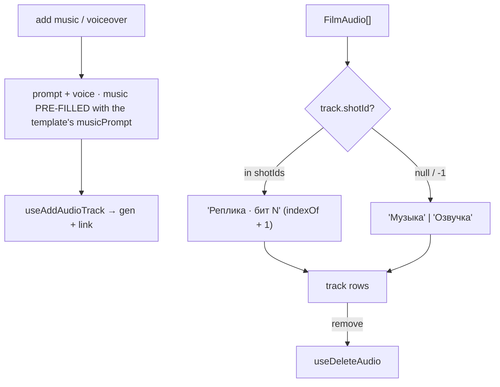

# AudioTracks.tsx — AI component doc

> AI-facing sidecar for `AudioTracks.tsx`. Created 2026-07-09. Keep this in sync with the code on every change.

## Purpose

The secondary audio rail: add a music bed or voiceover (generate the audio clip +
link it as a track, in one action) and list existing tracks with remove.

## What it does (for an AI reader)

- Responsibilities: compose the film's tracklist; open a per-kind mini-form.
- Public API / exports: `AudioTracks`,
  `AudioTracksProps = { filmId, audio, audioModels, musicPrompt?, shotIds? }`.
- Inputs → Outputs: form → `useAddAudioTrack`; row remove → `useDeleteAudio`.
- Side effects: `useAddAudioTrack` (POST generation + POST audio), `useDeleteAudio`.

## Dependencies

- Imports: `react` (`useState`), `react-i18next`, `shared/ui` (`Button`, `Card`,
  `Select`), `useAddAudioTrack`/`useDeleteAudio`, icons.
- Used by: `FilmEditor` (bottom of the stage column).

## Diagram

## Key decisions / gotchas

- v4 surface: a TITLED `Card surface="steel"`. Steel is flat — no specular edge,
  no shadow — so audio recedes behind the stage and the export action. The title
  also makes it a labelled region a screen reader can jump to.
- The mini-form is a nested `Card surface="well"` — a drawer that opened inside
  the card, not a second panel beside it.
- Music model vs tts model are picked by `audioKind` from the passed `audioModels`
  (from the catalog). Voices come from the tts model's `voices`.
- The link happens while the audio generation is still processing; the track
  resolves when the generation completes.

## Key decisions (2026-07-11) — template catalog

- **`musicPrompt` PRE-FILLS the music form** (`open('music')` seeds the input with
  it). Resolved at the route from `film.templateId`, `null` for a hand-made film.
  This is the quiet payoff of the template catalog: "melancholic soap-opera strings,
  dramatic piano, slow and heavy" is not a thing a user thinks to write — it is a
  thing someone who has watched a hundred of these videos knows. It is a **DEFAULT,
  not a decision**: it lands in the field, where the user can rewrite or clear it
  before spending anything.
- **`shotIds` (in timeline order) is used ONLY to NAME a track.** A shot-attached
  voiceover reads "Реплика · бит 4" instead of an eighth identical "Озвучка" row. A
  drama has eight of these; without the beat number the list is unreadable and the
  remove buttons are a guessing game.
- **`indexOf` returning `-1` is a real state, not an error**: the shot was deleted out
  from under the track. It still PLAYS (the render mixes by `startMs`, not by shot),
  so the row falls back to naming it by kind rather than hiding it — an invisible
  track the user is still paying to render is worse than an oddly-named one.
- The voiceover tracks themselves are created by `ShotInspector` (via
  `useGenerateVoiceover`), not here. This panel's own "add voiceover" button is the
  hand-placed, film-wide path — it posts `shotId: null` and therefore APPENDS rather
  than replaces.

## Commits

- _no commit yet_
