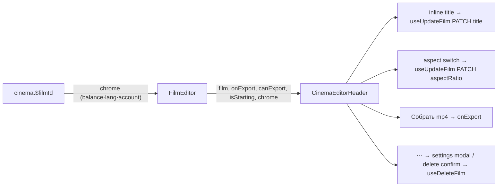

# CinemaEditorHeader.tsx — AI component doc

> AI-facing sidecar for `CinemaEditorHeader.tsx`. Created 2026-07-22. Keep this in sync with the code on every change.

## Purpose
The CinemaStudio editor's OWN top bar. It REPLACES the global `AppShell` nav on
`/cinema/$filmId` (owner request 2026-07-23) — one full-bleed steel bar carrying the film's
real controls, replacing the old two-bar stack (global nav ABOVE an in-page `FilmEditorHeader`
whose ⋯ menu HID the export). Successor to the deleted `FilmEditorHeader`.

## v2 "Собранный бар" (2026-07-23)
The first pass read as a soup of controls (aspect = 3 permanent toggles fighting the title,
nothing grouped, no dominant action). v2 applies the header-pattern laws in design.md §13:
zones with one rhythm, dominant title (wordmark dropped), aspect as a CHIP-DROPDOWN with a
checked current value, film META chips (aspect · N shots · m:ss) under the title, «Собрать
mp4» as the one icon-led primary, and a hairline divider before the quieter global chrome.

## What it does (for an AI reader)
- Responsibilities: render the editor's single top bar — `‹` back link to `/cinema`; the film
  title as the DOMINANT inline-editable h1; a `16:9 ▾` aspect chip-dropdown (checked current);
  a META row (aspect · shot count · duration); a green icon-led «Собрать mp4» primary button; a
  ⋯ menu (settings + destructive delete); a divider; and the injected `chrome` slot.
- Public API / exports / props / endpoints: `CinemaEditorHeader({ film, onExport, canExport,
  isStarting, shotCount?, durationMs?, chrome? })` + `CinemaEditorHeaderProps`. `film: Film |
  undefined` (Skeleton title while loading). Endpoints via hooks: `useUpdateFilm` (PATCH title /
  aspectRatio), `useDeleteFilm` (DELETE), `FilmSettingsModal` (edit). `formatTimecode` renders
  the duration; `t('cinema.header.shots', {count})` pluralizes the shot count.
- Inputs → Outputs: film + export state (props) → the bar; title/aspect edits → PATCH
  `/api/films/:id`; delete → DELETE then navigate `/cinema`; export click → `onExport()`.
- Side effects (I/O, network, state): the film PATCH/DELETE mutations; local `isEditing`,
  `isSettingsOpen`, `isConfirmOpen` state; router navigation on delete.

## Dependencies
- Imports / depends on: `@tanstack/react-router` (`Link`, `useNavigate`), `react-i18next`,
  `@opencreate/contracts` (`Film`, `AspectRatio`, `aspectRatioSchema`), `shared/ui`
  (`Button`, `Menu`, `Modal`, `Skeleton`), `../model/filmsApi` (`useUpdateFilm`,
  `useDeleteFilm`), `../model/timelineGeometry` (`formatTimecode`), `./FilmSettingsModal`,
  `./icons` (`ChevronLeftIcon`, `PlayIcon`).
- Used by: `FilmEditor.tsx` (renders it as the full-bleed bar above the workbench, passing the
  export state it owns + the `chrome` slot it received from the route).

## Diagram

## Key decisions / gotchas
- The `chrome` slot pattern (balance/lang/account injected by the route) exists because this
  module MUST NOT import `modules/Auth` / `modules/Credits` — same law AppShell obeys.
- Export is DISABLED, not removed, when `!canExport` — a header CTA that vanishes reads as a
  bug (unlike a menu item, where the "menu law" removes unavailable actions).
- Title/aspect edits use `updateFilmInputSchema` PARTIAL patches (`{ title }` / `{ aspectRatio }`).
- Style default is no longer inline — it stays reachable via the ⋯ "Настройки фильма"
  (`FilmSettingsModal` edit) so nothing regressed when title/aspect moved into the bar.
- Height budget: the bar mirrors AppShell's 44px so `FilmEditor`'s `calc(100svh-76px)` column
  math is unchanged (44px bar + 32px main py = 76px).

## Commits
- _no commit yet_

## Update 2026-07-31 — carries the style registry to the settings modal
- Gains `styles?: readonly Style[]`, passed straight through to `FilmSettingsModal`
  where the film's default style is picked. Pure pass-through: this bar renders no
  style UI of its own.
- Route-injected on the same seam as `chrome` — Cinema must not import `modules/Styles`.

## Update 2026-07-31 — the settings modal mounts only while open
- Found while auditing for more instances of the EntityLibrary/StyleLibrary defect.
  `FilmSettingsModal` was guarded on `film` alone, so it mounted the moment the film
  loaded and stayed mounted — while it seeds its fields with `useState(film?.title ?? '')`,
  which runs once at mount.
- **Why that bites HERE specifically:** both of the other controls in this same bar go
  on mutating the film underneath it — `FilmTitleField` renames it and `AspectChip`
  changes its ratio, each through `useUpdateFilm`. So after an inline rename the
  settings form still held the OLD title, and saving a default-style change from it
  would have silently reverted the rename.
- **Fix:** `{isSettingsOpen ? <FilmSettingsModal … isOpen/> : null}` — mount on open, the
  `SoulCard` → `SoulEditModal` precedent ("mounted only while open, so each edit starts
  from the SAVED soul"). A mount guard rather than a `key` because the film's id never
  changes; what goes stale is its CONTENT.
- **Now covered** (the gap above is closed). `CinemaEditorHeader.test.tsx` gained
  `renderHeaderWithMutableFilm`, a second harness whose `film` can change AFTER mount —
  the plain one bakes the prop into a router route component and cannot. The test
  refreshes the film, opens Film settings, and asserts the Title field carries the NEW
  title. Verified red-green against the production code: with the mount guard removed the
  field came back «Neon Drift» instead of «Renamed Live» — the reversion bug itself.
  The harness's `simulate-parent-refresh` button is a test-only stand-in for "the parent
  re-rendered with fresh film data"; the real triggers are FilmTitleField and AspectChip,
  both of which PATCH the film from this same bar.
