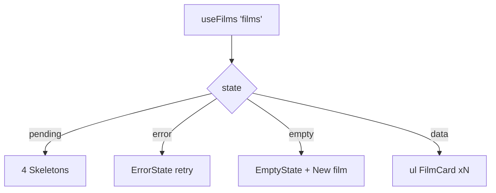

# CinemaLibrary.tsx — AI component doc

> AI-facing sidecar for `CinemaLibrary.tsx`. Created 2026-07-09. Keep this in sync with the code on every change.

## Purpose

The `/cinema` page body: the film library implementing the full 4-states rule
plus the "New film" modal.

## What it does (for an AI reader)

- Responsibilities: list orchestration (4 states); per-card render is `FilmCard`.
- Public API / exports: `CinemaLibrary` (no props).
- Inputs → Outputs:
  - loading → 4 canvas-shaped `Skeleton`s (static keys)
  - error → `ErrorState` + retry (refetch)
  - empty → `EmptyState` + a "New film" action
  - data → grid of `FilmCard`
- Side effects: `useFilms` query (`['films']`); opens `FilmSettingsModal`.

## Dependencies

- Imports: `react-i18next`, `shared/ui` (`Button`, `EmptyState`, `ErrorState`,
  `Skeleton`), `useFilms`, `FilmCard`, `FilmSettingsModal`, `PlusIcon`.
- Used by: `routes/_shell.cinema.index.tsx` (via `modules/Cinema` public API).

## Diagram

## Key decisions / gotchas

- The create modal is always mounted (film=null) so the header and empty-state
  actions share one trigger; it navigates into the new film on success.

## Commits

- _no commit yet_
