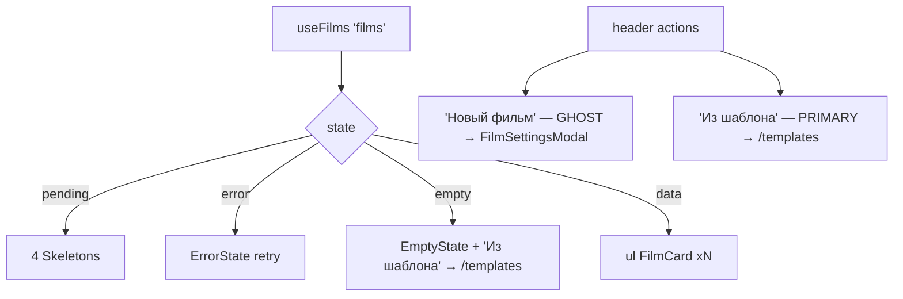

# CinemaLibrary.tsx — AI component doc

> AI-facing sidecar for `CinemaLibrary.tsx`. Created 2026-07-09. Keep this in sync with the code on every change.

## Purpose

The `/cinema` page body: the film library implementing the full 4-states rule
plus the "New film" modal.

## What it does (for an AI reader)

- Responsibilities: list orchestration (4 states); per-card render is `FilmCard`.
- Public API / exports: `CinemaLibrary` (no props).
- Inputs → Outputs:
  - loading → 4 card-shaped `Skeleton` groups: plate + 2 meta lines (static keys)
  - error → `ErrorState` + retry (refetch)
  - empty → `EmptyState` whose action is "Из шаблона" (a `Link` to `/templates`)
  - data → grid of `FilmCard`
- Side effects: `useFilms` query (`['films']`); opens `FilmSettingsModal`.

## Dependencies

- Imports: `react-i18next`, `@tanstack/react-router` (`Link`), `shared/ui`
  (`Button`, `EmptyState`, `ErrorState`, `Skeleton`), `useFilms`, `FilmCard`,
  `FilmSettingsModal`, `PlusIcon`.
- Used by: `routes/_shell.cinema.index.tsx` (via `modules/Cinema` public API).

## Diagram

## Key decisions / gotchas

- The create modal is always mounted (film=null) so the header action has a
  trigger; it navigates into the new film on success.
- The grid tops out at 4 columns (was 5): a v4 `FilmCard` is a padded glass card,
  not a bare tile, and needs the extra width to stay legible.
- The loading silhouette mirrors the card (plate + two meta lines) so the grid
  does not reflow when data lands.

## Key decisions (2026-07-11) — template catalog

- **Templates LEAD; "New film" is demoted to the ghost button.** An empty timeline is
  the harder path and the worse first experience — a user who has never made one of
  these does not know what eight beats of a cheating-fruit drama look like, and the
  catalog does. The **empty state's only action is the template catalog**, for the
  same reason: a user with zero films is exactly the user who should not be starting
  from a blank timeline.
- **Both are plain `<Link to="/templates">`, not an import.** Cinema does not import
  Templates (see `modules/Templates/index.ts` on the module boundary) — the route IS
  the seam.

## Commits

- _no commit yet_
