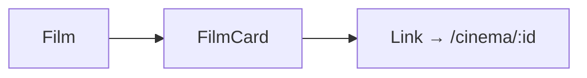

# FilmCard.tsx — AI component doc

> AI-facing sidecar for `FilmCard.tsx`. Created 2026-07-09. Keep this in sync with the code on every change.

## Purpose

One film in the library grid: a canvas-shaped abyss plate (no cover in the list
payload → a quiet film glyph) with title, aspect chip and "updated" caption. The
whole plate is a typed `<Link>` into the editor.

## What it does (for an AI reader)

- Responsibilities: render one `Film` as a navigable card.
- Public API / exports: `FilmCard`, `FilmCardProps = { film: Film }`.
- Inputs → Outputs: `Film` → a `<Link to="/cinema/$filmId">`.
- Side effects: none (navigation on click via the Link).

## Dependencies

- Imports: `@tanstack/react-router` (`Link`), `react-i18next`, `Badge` from
  `shared/ui`, `TextCardIcon`.
- Used by: `CinemaLibrary`.

## Diagram

## Key decisions / gotchas

- The plate is shaped to the film's aspect (16:9 → aspect-video, etc.) so it
  previews the real output shape, not a square lie.
- Date is localized via `Intl.DateTimeFormat(i18n.language)`; the ISO string stays
  the source of truth.

## Commits

- _no commit yet_
