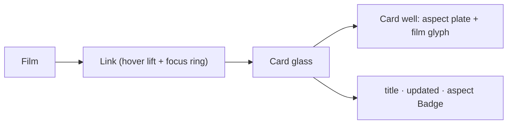

# FilmCard.tsx — AI component doc

> AI-facing sidecar for `FilmCard.tsx`. Created 2026-07-09. Keep this in sync with the code on every change.

## Purpose

One film in the library grid: a glass `Card` whose picture area is a recessed
`well` plate shaped to the film's canvas (no cover in the list payload → a quiet
film glyph), with title, aspect chip and "updated" caption below. The whole card
is a typed `<Link>` into the editor.

## What it does (for an AI reader)

- Responsibilities: render one `Film` as a navigable card.
- Public API / exports: `FilmCard`, `FilmCardProps = { film: Film }`.
- Inputs → Outputs: `Film` → a `<Link to="/cinema/$filmId">`.
- Side effects: none (navigation on click via the Link).

## Dependencies

- Imports: `@tanstack/react-router` (`Link`), `react-i18next`, `Badge` + `Card`
  from `shared/ui`, `TextCardIcon`.
- Used by: `CinemaLibrary`.
- Tested by: `CinemaLibrary.test.tsx` (title + link href per card).

## Diagram

## Key decisions / gotchas

- v4: glass card + nested well plate. Two surfaces do the depth work that a bare
  v3 tile on the void could not.
- The hover lift and the focus ring live on the `<Link>`, not on the `Card` —
  `Card.className` is a layout escape hatch, never surface or motion styling.
- The plate is shaped to the film's aspect (16:9 → aspect-video, etc.) so it
  previews the real output shape, not a square lie.
- Date is localized via `Intl.DateTimeFormat(i18n.language)`; the ISO string stays
  the source of truth.

## Commits

- _no commit yet_
