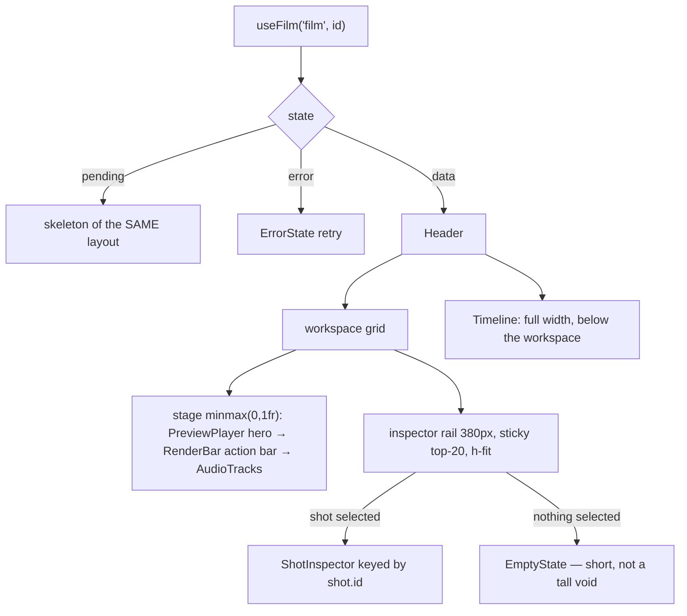

# FilmEditor.tsx — AI component doc

> AI-facing sidecar for `FilmEditor.tsx`. Created 2026-07-09. Keep this in sync with the code on every change.

## Purpose

The `/cinema/$filmId` editor body: loads the film's composite detail (4 states)
and lays out the workspace — header, a stage column beside a sticky inspector
rail, and the full-width timeline strip below them.

## What it does (for an AI reader)

- Responsibilities: 4-states over `useFilm`; own the selected-shot id; split the
  catalog into video/audio lists; resolve the film's template; compute the selected
  shot's timeline offset and voiced state; compose the child surfaces.
- Public API / exports: `FilmEditor`,
  `FilmEditorProps = { filmId, models, templates? }`.
- Inputs → Outputs: `filmId` + catalog `models` + the template list → the full editor.
- Side effects: `useFilm` query; local UI state (selection, storyboard modal).

## Dependencies

- Imports: `react` (`useState`), `react-i18next`, contract catalog types +
  `TemplateSummary`, `shared/ui` (`EmptyState`, `ErrorState`, `Skeleton`),
  `useFilm`, `shotStartMs` (from `../model/voiceoverApi`), and every editor child
  (`FilmEditorHeader`, `Timeline`, `PreviewPlayer`, `RenderBar`, `AudioTracks`,
  `ShotInspector`, `StoryboardModal`).
- Used by: `routes/_shell.cinema.$filmId.tsx` (via `modules/Cinema`) — which is
  also where BOTH `models` and `templates` come from.

## Diagram

## Key decisions / gotchas

- v4 layout. The old `lg:grid-cols-2` deck forced ONE inspector panel to stretch
  to the combined height of preview + render + audio, so with no shot selected
  the right half was a tall empty rectangle. The rail is now `h-fit` + `sticky`.
- `minmax(0,1fr)` (not `1fr`) for the stage: a wide video or a long prompt can
  never push the fixed 380px rail off the grid.
- `lg:top-20` clears the app's sticky steel nav (`h-16`); `top-6` would slide the
  inspector under it while scrolling.
- The `PANEL` class string (`rounded-lg border border-white/10 p-4`) is GONE —
  panels are `Card`, and each child owns its own surface (`well` / `glass` /
  `steel`), which is what restores the visual hierarchy.
- Owns the ONE shared UI state (selected shot id) so strip and inspector agree.
- The inspector is keyed by `shot.id` so a new selection re-initialises cleanly.
- Catalog `models` arrive from the route (cross-module seam) and are split into
  `videoModels`/`audioModels` here.
- The loading skeleton mirrors the NEW layout (stage column + rail + strip).

## Key decisions (2026-07-11) — template catalog

- **`templates?: TemplateSummary[]` is injected FROM THE ROUTE — the same seam
  `models` uses, and the reason Cinema still imports nothing from Templates.** The
  route cannot resolve the film's template itself (it does not load the film; this
  component does), so it hands over the whole list and the lookup happens here:
  `templates.find(t => t.id === data.film.templateId)?.musicPrompt ?? null`.
- **What we actually want out of it is ONE string**: the music bed the film's
  template recommends, which pre-fills the audio panel. "Melancholic soap-opera
  strings, dramatic piano, slow and heavy" is not something a user thinks to write —
  it is something a person who has watched a hundred of these videos knows, and
  handing it over as an editable default is most of the difference between a film
  that sounds like the format and one that doesn't.
- `musicPrompt` is `null` both for a hand-made film AND while `['templates']` is
  still in flight. In both cases the audio panel simply opens with an empty music
  field — exactly what it did before templates existed. The prop defaults to `[]`.
- **This component is the only place that knows every shot's duration**, so it is the
  only place that can say where on the timeline a shot's spoken line belongs:
  `selectedStartMs = shotStartMs(data.shots, selectedShot.id)`. The inspector
  receives the ANSWER, not the shot list.
- `isSelectedVoiced = data.audio.some(track => track.shotId === selectedShotId)` — the
  same one-line read is what lets the inspector's voice button say "Re-voice" instead
  of silently charging for a duplicate track.
- `ttsModel` is pulled out of `audioModels` here and passed down; `undefined` hides
  the inspector's whole Voice section.

## Update 2026-07-15 — v5 compact editor pass
- The Timeline moved ABOVE the workspace (right under the title row). At the bottom it
  lived below the fold on laptop viewports — selecting a beat meant scrolling twice per
  edit. The strip is the film's table of contents; contents go first.
- Density: outer/stage/WORKSPACE gaps 6→4, inspector rail 380→360px, RAIL sticky offset
  top-20→top-14 (the app bar is 44px since the v3.1 compact shell). Loading skeleton
  mirrors the new order (title → strip band → stage/rail).

## Update 2026-07-15 — v6 composer dock
- The 360px sticky inspector rail is RETIRED: `ShotInspector` became a composer
  dock fixed to the viewport bottom (it renders its own fixed shell). The stage
  (preview · export · audio) spans the full width now.
- The editor body carries `pb-36` so the floating dock never hides the audio
  card; with no shot selected a slim steel hint bar (same `DOCK` shell,
  `cinema.inspector.selectHint`) holds the dock's place so clearance never jumps.
- `EmptyState` import dropped (the hint bar replaced it); `WORKSPACE`/`RAIL`
  grid constants replaced by the single `DOCK` shell class. Loading skeleton is
  single-column.

## Commits

- _no commit yet_
