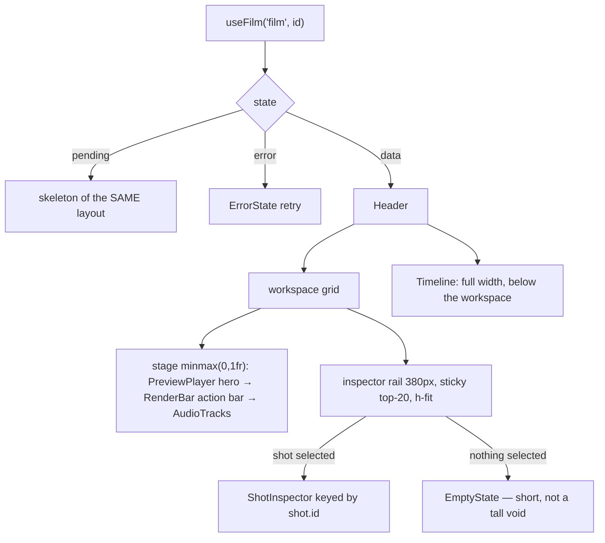

# FilmEditor.tsx — AI component doc

> AI-facing sidecar for `FilmEditor.tsx`. Created 2026-07-09. Keep this in sync with the code on every change.

## Purpose

The `/cinema/$filmId` editor body: loads the film's composite detail (4 states)
and lays out the workspace — header, a stage column beside a sticky inspector
rail, and the full-width timeline strip below them.

## What it does (for an AI reader)

- Responsibilities: 4-states over `useFilm`; own the selected-shot id; split the
  catalog into video/audio lists; resolve the film's template; compute the selected
  shot's timeline offset and voiced state; compose the child surfaces.
- Public API / exports: `FilmEditor`,
  `FilmEditorProps = { filmId, models, templates? }`.
- Inputs → Outputs: `filmId` + catalog `models` + the template list → the full editor.
- Side effects: `useFilm` query; local UI state (selection, storyboard modal).

## Dependencies

- Imports: `react` (`useEffect`, `useState`), `react-i18next`, `@tanstack/react-router`
  (`useNavigate` — Export to Canvas's post-create navigation), contract catalog
  types + `TemplateSummary`, `shared/ui` (`ErrorState`, `Skeleton`, `toast`),
  `modules/Canvas` (`useCreateCanvas`, `saveCanvas` — the ONE approved cross-module
  exception, see the Update below), `../model/exportToCanvas`
  (`buildCanvasDocFromFilm`), `useFilm`, `../model/shotGeneration`
  (`useShotGenerations`, reused for Export to Canvas), `useExportController` (the
  CLIENT export cutover — 2026-07-23, replaces `useCreateRender`/`useRender`/
  `renderBlockCopy`), `useTimelineClock` (`reset` on film change), `totalDurationMs`,
  `useTimelineKeys` (editor keyboard shortcuts — Phase 4), `shotStartMs` (from
  `../model/voiceoverApi`), and every editor child
  (`CinemaEditorHeader` — the
  editor's OWN full-bleed top bar, rendered in every state; `Timeline`,
  `PreviewPlayer`, `RenderBar`, `AudioTracks`, `ShotInspector`, `StoryboardModal`).
  Takes a `chrome?: ReactNode` prop (balance·lang·account) and passes it straight
  through to the header — FilmEditor imports no Auth/Credits. Also computes and
  passes the header's META (`shotCount` = `data.shots.length`, `durationMs` =
  `totalDurationMs(data.shots)` from `../model/timelineGeometry`).
- Used by: `routes/cinema.$filmId.tsx` (via `modules/Cinema`) — a STANDALONE route
  (no `_shell`) which also supplies `models`, `templates`, `entities` and `chrome`.

## Diagram

## Key decisions / gotchas

- v4 layout. The old `lg:grid-cols-2` deck forced ONE inspector panel to stretch
  to the combined height of preview + render + audio, so with no shot selected
  the right half was a tall empty rectangle. The rail is now `h-fit` + `sticky`.
- `minmax(0,1fr)` (not `1fr`) for the stage: a wide video or a long prompt can
  never push the fixed 380px rail off the grid.
- `lg:top-20` clears the app's sticky steel nav (`h-16`); `top-6` would slide the
  inspector under it while scrolling.
- The `PANEL` class string (`rounded-lg border border-white/10 p-4`) is GONE —
  panels are `Card`, and each child owns its own surface (`well` / `glass` /
  `steel`), which is what restores the visual hierarchy.
- Owns the ONE shared UI state (selected shot id) so strip and inspector agree.
- The inspector is keyed by `shot.id` so a new selection re-initialises cleanly.
- Catalog `models` arrive from the route (cross-module seam) and are split into
  `videoModels`/`audioModels` here.
- The loading skeleton mirrors the NEW layout (stage column + rail + strip).

## Key decisions (2026-07-11) — template catalog

- **`templates?: TemplateSummary[]` is injected FROM THE ROUTE — the same seam
  `models` uses, and the reason Cinema still imports nothing from Templates.** The
  route cannot resolve the film's template itself (it does not load the film; this
  component does), so it hands over the whole list and the lookup happens here:
  `templates.find(t => t.id === data.film.templateId)?.musicPrompt ?? null`.
- **What we actually want out of it is ONE string**: the music bed the film's
  template recommends, which pre-fills the audio panel. "Melancholic soap-opera
  strings, dramatic piano, slow and heavy" is not something a user thinks to write —
  it is something a person who has watched a hundred of these videos knows, and
  handing it over as an editable default is most of the difference between a film
  that sounds like the format and one that doesn't.
- `musicPrompt` is `null` both for a hand-made film AND while `['templates']` is
  still in flight. In both cases the audio panel simply opens with an empty music
  field — exactly what it did before templates existed. The prop defaults to `[]`.
- **This component is the only place that knows every shot's duration**, so it is the
  only place that can say where on the timeline a shot's spoken line belongs:
  `selectedStartMs = shotStartMs(data.shots, selectedShot.id)`. The inspector
  receives the ANSWER, not the shot list.
- `isSelectedVoiced = data.audio.some(track => track.shotId === selectedShotId)` — the
  same one-line read is what lets the inspector's voice button say "Re-voice" instead
  of silently charging for a duplicate track.
- `ttsModel` is pulled out of `audioModels` here and passed down; `undefined` hides
  the inspector's whole Voice section.

## Update 2026-07-15 — v5 compact editor pass
- The Timeline moved ABOVE the workspace (right under the title row). At the bottom it
  lived below the fold on laptop viewports — selecting a beat meant scrolling twice per
  edit. The strip is the film's table of contents; contents go first.
- Density: outer/stage/WORKSPACE gaps 6→4, inspector rail 380→360px, RAIL sticky offset
  top-20→top-14 (the app bar is 44px since the v3.1 compact shell). Loading skeleton
  mirrors the new order (title → strip band → stage/rail).

## Update 2026-07-15 — v6 composer dock
- The 360px sticky inspector rail is RETIRED: `ShotInspector` became a composer
  dock fixed to the viewport bottom (it renders its own fixed shell). The stage
  (preview · export · audio) spans the full width now.
- The editor body carries `pb-36` so the floating dock never hides the audio
  card; with no shot selected a slim steel hint bar (same `DOCK` shell,
  `cinema.inspector.selectHint`) holds the dock's place so clearance never jumps.
- `EmptyState` import dropped (the hint bar replaced it); `WORKSPACE`/`RAIL`
  grid constants replaced by the single `DOCK` shell class. Loading skeleton is
  single-column.

## Update 2026-07-16 — v7: NLE workbench + export in the ⋯ menu
- The editor is ONE viewport-height column (`h-[calc(100svh-76px)]`, no page
  scroll): a STAGE (title row · transient RenderBar strip · preview) scrolling
  inside itself, and a WORKBENCH pinned at the bottom — the composer above the
  TRACKS panel, like a real edit bay.
- Export state lives HERE: `useCreateRender` + tracked `renderId` +
  `useRender` poll — the header's ⋯ menu (hides «Собрать mp4» while one runs)
  and the status strip must read one truth. `AudioTracks` card deleted; sound
  became a timeline lane (Timeline v7 absorbs add-music/voice).

## Update 2026-07-17 — default-select the first shot
- **The FIRST shot is selected by default** (owner report: «куда чат пропал» —
  with nothing selected the workbench showed only the slim hint row, and users
  read the missing composer as a broken page). The selection is DERIVED, not an
  effect: `selectedShot = shots.find(s => s.id === selectedShotId) ?? shots[0]`.
- An explicit tile click still wins (it sets `selectedShotId`); deleting the
  selected shot falls back to the first shot instead of an empty dock; a film
  with zero shots keeps the hint row.
- Downstream reads use the EFFECTIVE selection: `isSelectedVoiced` compares
  against `selectedShot?.id`, and `Timeline` receives `selectedShot?.id ?? null`
  so the highlighted tile always matches the shot the composer is editing.
- Covered by `FilmEditor.test.tsx`: composer opens with shot 1's draft without
  a click; zero shots → hint row.

## Update 2026-07-17 — composer is a position:fixed DOCK
- **The composer left the column flow entirely** (owner directives, same day,
  two steps: «поле промпта — fixed снизу», then «чтобы он размеры экрана не
  занимал»): it renders after the column in a
  `pointer-events-none fixed inset-x-0 bottom-0 z-40 px-4 pb-4 xl:px-6`
  click-through wrapper (inner div re-enables pointer events). z-40 floats over
  the workbench, under Modal's z-50. Horizontal padding mirrors the route
  canvas so the dock stays aligned with the column edges.
- **Why fixed, not last-in-flow:** in flow, dock GROWTH (drawers, prompt
  resize) squeezed the stage and the tracks. Fixed, growth extends UPWARD and
  OVERLAYS them — the column reserves only the collapsed height (`pb-28` on
  `EDITOR_COLUMN`; the column doesn't scroll, so without that clearance the
  tracks would sit under the dock forever).
- The hint row (zero shots) lives in the same dock; loading skeleton reserves
  nothing for the composer (tracks silhouette only).
- Covered by `FilmEditor.test.tsx`: composer `region` follows the timeline in
  DOM order AND sits inside a `.fixed` wrapper.

## Update 2026-07-21 — a render survives the tab that started it

The bug: `renderId` was `useState`, and the film detail carried nothing about
renders. A reload therefore lost a running export entirely — the strip vanished,
the ⋯ menu re-offered Export (starting a SECOND ffmpeg job on the same film), and
a finished mp4 became unreachable from the UI even though the file was on disk.

- **The film is now the authority.** `filmDetailSchema` carries
  `latestRender: FilmRender | null`, so `useFilm` already answers "what happened
  to my export?" on every mount. Resolution order:
  `renderId = startedId ?? data?.latestRender?.id ?? null`, where `startedId` is
  only an optimistic override covering the gap between this tab's kick-off and
  the detail refetch. Both are read BEFORE the pending/error guards so the render
  query is called unconditionally (stable hook order).
- **The strip paints from the film, then the poll.**
  `activeRender = renderQuery.data ?? latestRender ?? undefined` — no cache
  seeding games, and no empty flash on a cold load.
- **`isExporting` is SERVER truth now.** It was a tab-local flag, so a second tab
  (or this one after a reload) would happily start a competing encode. The API
  refuses a concurrent render outright (409 `conflict`, `FilmRenderInProgressError`);
  this keeps the UI from offering an action it knows will be refused.
- **`isPollFailed`** = `renderId !== null && renderQuery.isError && failureCount > 0`,
  handed to `RenderBar` so a render we can no longer see stops rendering a
  progress bar and offers `onRefreshStatus` (a status re-check — never a second
  export).
- **`blockedMessage`** turns the kick-off's machine code into our own copy:
  `validation_failed` → «экспорт пока не может начаться» (the timeline isn't
  ready — ffmpeg never ran, so the old "the render didn't finish" was false),
  `conflict` → «уже собирается», anything else → `errorCodeMessageKey`. Raw
  server prose is never rendered.
- Covered by `FilmEditor.test.tsx`: a finished render offers its download on a
  cold load; a running one repaints AND resumes its poll; Export is hidden while
  the server says one is running and returns once it settles.

### SEAM — per-reason refusal copy (plan option A) — **CLOSED 2026-07-21**

_Historical note, kept because the sequencing reasoning is still worth having._
This seam was deliberately deferred while `assembly-models` moved audio readiness
into `buildPlan`: an enum defined over a still-growing refusal set arrives
incomplete, and its failure mode is silent fall-through to the generic string —
the exact bug it exists to fix. It was defined once the set stopped moving.

**It has now landed.** Two things about it differ from the sketch above, so read
the code rather than this paragraph:

- The refusal set is **TEN**, not seven. Two throw sites were SPLIT
  (`shot_clip_processing`/`shot_clip_failed`, and the audio branch into four),
  because a still-processing subject and a failed one need opposite instructions
  and had been sharing one hedging sentence.
- Copy keys are **`cinema.render.blockedReason.*`**, not `cinema.render.reason.*`,
  and the lookup is an exhaustive `Record<RenderBlockReason, string>` in
  `model/renderBlockCopy.ts` rather than an interpolated template key. That is the
  point: a template key cannot be checked, so a missing member would render a raw
  key at runtime; the Record makes it a TYPECHECK error instead.

The prediction that this is a **widening, not a rewrite**, held exactly — the
`validation_failed` branch grew, the `conflict` and default branches were left
untouched, and `RenderBar` needed no restructuring (it gained one optional
`onShowSubject` prop for the jump affordance and nothing else).

The in-code SEAM block was **removed** once this landed: it described the work in
the future tense four lines above the code that already did it, and a comment
that contradicts the code beneath it is how the next reader gets misled. Its one
still-load-bearing warning was kept and moved into the code instead — **do not
fold the `conflict` branch into the reason path.** A 409 carries no reason, so
narrowing the ternary to `validation_failed` alone drops it to `null`, RenderBar
early-returns, and a duplicate-export click renders nothing at all — a dead click
that passes typecheck, lint and every other test in the file. It is pinned by two
409 cases in `FilmEditor.test.tsx`, verified by deliberately re-introducing the
narrowing and confirming that ONLY those two went red (the other 14 passed
straight through it, which is why the hole was invisible before).

## Update 2026-07-21 — the refusal says WHICH and WHAT TO DO

`blockedMessage` is no longer one string for every `validation_failed`. The kick-off
error's `detail` (`reason` + subject) goes through `model/renderBlockCopy.ts`, which
returns copy naming the blocker and giving exactly one action — wait, regenerate, or
remove. An absent or unrecognized reason falls back to the previous generic sentence,
so an older server (or a future reason) degrades calmly.

When the blocker is a SHOT, `onShowSubject` is wired to `setSelectedShotId`. That is a
one-liner only because selection already lives in this component and already drives both
the composer and the tile highlight. Audio tracks and the film itself get no jump —
selection is shot-level here.

Scroll-into-view is NOT implemented: `Timeline`'s horizontal scroll container exposes no
imperative handle. A decision, not an oversight — see `renderBlockCopy.ts.md`.

### The `conflict` branch is load-bearing — do not fold it into the reason path

A 409 is the one export refusal that is **not** `validation_failed`, so it rides
its own branch of the `blockedMessage` ternary. Narrowing that ternary to handle
only `validation_failed + reason` yields `blockedMessage = null` for a 409, and
when the film has no render row to fall back on, `RenderBar` hits its early
return and paints **nothing** — the user clicks Export and literally nothing
happens, with typecheck, lint and the rest of the suite still green.

Pinned by two tests in `FilmEditor.test.tsx` that assert the STRIP, not the
string: a 409 must render a visible `role="alert"` saying "already being
exported", and must offer no retry pill. Verified as a real pin by deleting the
`conflict` branch and watching exactly those two tests — and only those two —
go red with `Unable to find role="alert"`.

### 2026-07-22 — v8 NLE Phase 1: it owns the clock lifecycle
The editor gained ONE coupling to the new timeline clock: a `useEffect` keyed on
`filmId` that `reset()`s `useTimelineClock` on open and on leave. The clock is a
singleton shared by `Timeline` and `PreviewPlayer` (that is how selection and the
playhead stay unified without prop-drilling), so without this reset a stale
playhead would carry across films. All actual seeking lives in the timeline
surfaces — the editor only zeroes the position on a film change.

### 2026-07-22 — v8 NLE Phase 4: editor keyboard shortcuts
Mounts `useTimelineKeys(filmId, data?.shots ?? [])` at the editor root — one
`keydown` listener for Space/←→/Shift+←→/Home/End/S (split), gated off text fields
so the composer keeps its typing. Mounted HERE (not Timeline) because the shortcuts
are editor-wide; `?? []` keeps the hook order stable through the loading state.

### 2026-07-23 — CLIENT-side export cutover (SUPERSEDES the server-render sections above)
The ~70-line server-render block (`useCreateRender` + `useRender` poll +
`latestRender` + `renderBlockCopy` derivation + the 409/reload handling) is REPLACED
by a single `const exp = useExportController(data)`. The export now runs in the
BROWSER (streaming WebCodecs); `render.ts` + the render routes stay in the repo,
dormant, un-invoked from this path. The header CTA reads `exp.onExport/canExport/
isStarting`; the RenderBar reads `exp.state/progress/blockedMessage/onShowSubject/
unsupportedMessage/onCancel/onRetry`. The VALUABLE server validation was preserved,
not deleted — `computeExportBlock` (inside the controller) refuses a not-ready film
(a clip generating/failed, no shots) with the SAME named `renderBlockCopy` reasons,
computed from the generation cache. DROPPED (server-only, no client equivalent):
reload-recovery of a running render, the 409 concurrency guard, poll-wedge handling.
FilmEditor shrank 362→294 lines. The `SEAM` + server-render decision sections above
are retained for provenance but describe the retired path. Tests: the server-render
cases in `FilmEditor.test.tsx` were rewritten to client-export cases (the pipeline
hook mocked, the block real).

## Commits

- a978142 2026-07-16 feat(cinema): редактор v7 — монтажный верстак с дорожками, экспорт в меню «⋯»

## Update 2026-07-22 — tightened the tracks↔composer gap
`EDITOR_COLUMN` bottom clearance `pb-28` → `pb-24` (owner: visible empty band
between the tracks and the fixed composer dock). The clearance must equal the
COLLAPSED dock height; the old 28 (112px) exceeded it, leaving a gap. If the
tracks ever tuck under the collapsed dock, step it back up (pb-24→pb-26/pb-28).
Blind-tuned (no browser session) — verify visually.

## Update 2026-07-31 — fans the style registry out to three pickers
- Gains `styles?: Style[]` (route-injected, defaults to `[]`) and hands it to all
  three style pickers on this screen: `ShotInspector` (the shot's style),
  `StoryboardModal` (the script's style) and `CinemaEditorHeader` → `FilmSettingsModal`
  (the film's default style).
- Same cross-module seam as `models`, `templates` and `entities`, and for the same
  reason: Cinema must not import `modules/Styles`. This component is the fan-out
  point because it is where all three consumers already live.
- Empty while `GET /api/styles` is in flight; each picker falls back to the bundled
  builtins, so no style choice ever disappears mid-request.

## Update 2026-08-04 — "Export to Canvas" (one-off, no live link back)

FilmEditor now owns the ⋯ menu's "Export to Canvas" action end to end. Converts the
CURRENT film's shots into a brand-new Canvas document, saves it, and navigates there —
a SNAPSHOT, not a sync: the produced canvas has no connection back to this film after
the click.

- **`modules/Canvas` import is the ONE approved exception** to "modules never import
  each other" (owner request). Only `useCreateCanvas` + `saveCanvas` cross the seam,
  via the module's public barrel — same discipline every other cross-module read in
  this file already follows (`models`/`templates`/`entities`/`styles` come from the
  ROUTE instead, because THOSE modules have no such exception).
- **The pure conversion lives OUTSIDE this component**: `model/exportToCanvas.ts`'s
  `buildCanvasDocFromFilm(film, shots, generationsById)` imports nothing from
  `modules/Canvas` and is unit-tested standalone. FilmEditor's job is only to gather
  its three inputs and act on the `CanvasExportDoc | null` it returns.
- **`generationsById` reuses `useShotGenerations`** (already used by the preview
  player) over `data.shots.map(s => s.generationId).filter(id => id !== null)` —
  the SAME `['generation', id]` cache every clip thumbnail reads, so no new network
  path is introduced. Called unconditionally with `data?.shots ?? []`-derived ids to
  keep hook order stable through the loading state (same discipline as
  `useTimelineKeys` above it).
- **`null` → an error toast, not an empty canvas.** `buildCanvasDocFromFilm` returns
  `null` when nothing is exportable (every shot a title card / unset / still
  processing / failed); the handler surfaces `toasts.exportToCanvas.empty*` and stops
  — matching this module's established failure pattern (`shotFailureToast.ts`'s
  `toast.error({ title, description })`, not a new UI pattern).
- **Flow on success:** `createCanvas.mutateAsync(doc.title)` →
  `saveCanvas(canvas.id, doc)` (the full node/edge doc, one PATCH) →
  `navigate({ to: '/canvas/$canvasId', params: { canvasId } })`. Any rejection
  (create OR save) is caught in ONE try/catch and surfaced as
  `toasts.exportToCanvas.failed*` — the same "one truth, one failure toast" shape as
  the empty case.
- **Re-entrancy is gated in the handler**, not the Menu: `Menu`'s `MenuItem` has no
  disabled/loading affordance, so a local `isExportingToCanvas` boolean short-circuits
  a second click while one export is already running; `CinemaEditorHeader` only reads
  it to swap the menu item's LABEL (idle ↔ "Exporting to Canvas…").
- Covered by `FilmEditor.test.tsx` (`describe('FilmEditor — export to Canvas')`): a
  successful export POSTs `/api/canvases`, PATCHes the new canvas, and navigates
  (asserted against a real `/canvas/$canvasId` stub route, not just "some navigation
  happened"); an all-title-card film raises exactly one error toast and never calls
  `/api/canvases`; a failed create call raises the "failed" toast instead.
