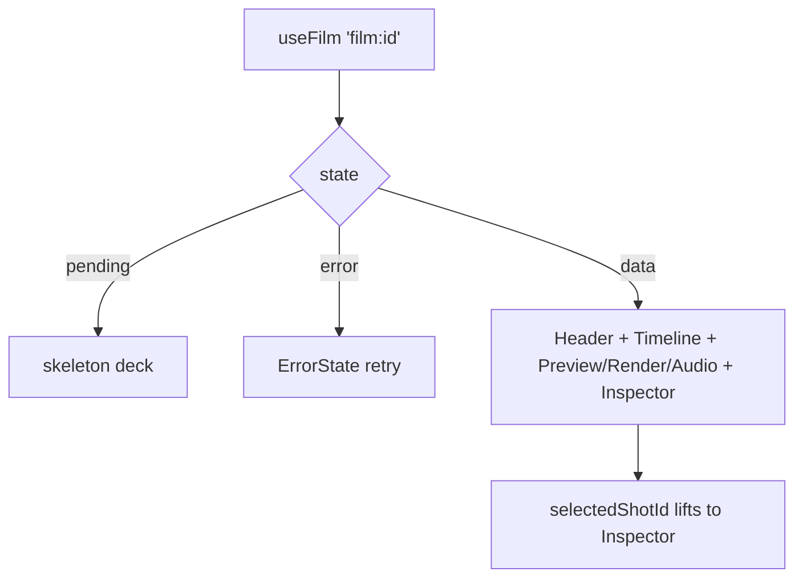

# FilmEditor.tsx — AI component doc

> AI-facing sidecar for `FilmEditor.tsx`. Created 2026-07-09. Keep this in sync with the code on every change.

## Purpose

The `/cinema/$filmId` editor body: loads the film's composite detail (4 states)
and lays out the workspace — header, timeline, and a two-column deck of
(preview + render + audio) beside the shot inspector.

## What it does (for an AI reader)

- Responsibilities: 4-states over `useFilm`; own the selected-shot id; split the
  catalog into video/audio lists; compose the child surfaces.
- Public API / exports: `FilmEditor`, `FilmEditorProps = { filmId, models }`.
- Inputs → Outputs: `filmId` + catalog `models` → the full editor.
- Side effects: `useFilm` query; local UI state (selection, storyboard modal).

## Dependencies

- Imports: `react` (`useState`), `react-i18next`, contract catalog types,
  `shared/ui` (`ErrorState`, `Skeleton`), `useFilm`, and every editor child
  (`FilmEditorHeader`, `Timeline`, `PreviewPlayer`, `RenderBar`, `AudioTracks`,
  `ShotInspector`, `StoryboardModal`).
- Used by: `routes/_shell.cinema.$filmId.tsx` (via `modules/Cinema`).

## Diagram

## Key decisions / gotchas

- Owns the ONE shared UI state (selected shot id) so strip and inspector agree.
- The inspector is keyed by `shot.id` so a new selection re-initialises cleanly.
- Catalog `models` arrive from the route (cross-module seam) and are split into
  `videoModels`/`audioModels` here.

## Commits

- _no commit yet_
