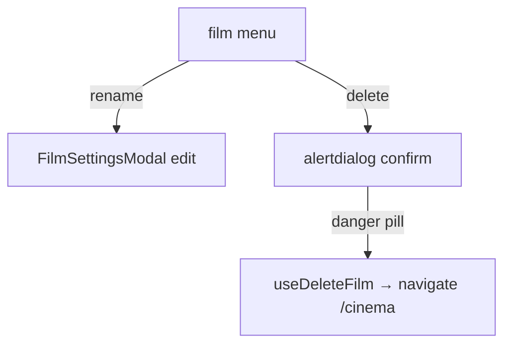

# FilmEditorHeader.tsx — AI component doc

> AI-facing sidecar for `FilmEditorHeader.tsx`. Created 2026-07-09. Keep this in sync with the code on every change.

## Purpose

The editor's top bar: back-to-library link, film title + canvas chip, and the
film overflow menu (rename → settings modal; delete → destructive-confirm).

## What it does (for an AI reader)

- Responsibilities: chrome + film-level actions (rename, delete-with-confirm).
- Public API / exports: `FilmEditorHeader`, `FilmEditorHeaderProps = { film }`.
- Inputs → Outputs: a `Film` → header + modals.
- Side effects: `useDeleteFilm`, `useNavigate` (→ /cinema after delete).

## Dependencies

- Imports: `@tanstack/react-router` (`Link`, `useNavigate`), `react-i18next`,
  `shared/ui` (`Badge`, `Button`, `Menu`, `Modal`), `useDeleteFilm`,
  `FilmSettingsModal`, `ChevronLeftIcon`.
- Used by: `FilmEditor`.

## Diagram

## Key decisions / gotchas

- Delete follows design.md §9: the mutation fires only on the danger-pill confirm,
  never in one click.
- Rename reuses `FilmSettingsModal` in edit mode (one component, two modes).

## Commits

- _no commit yet_
