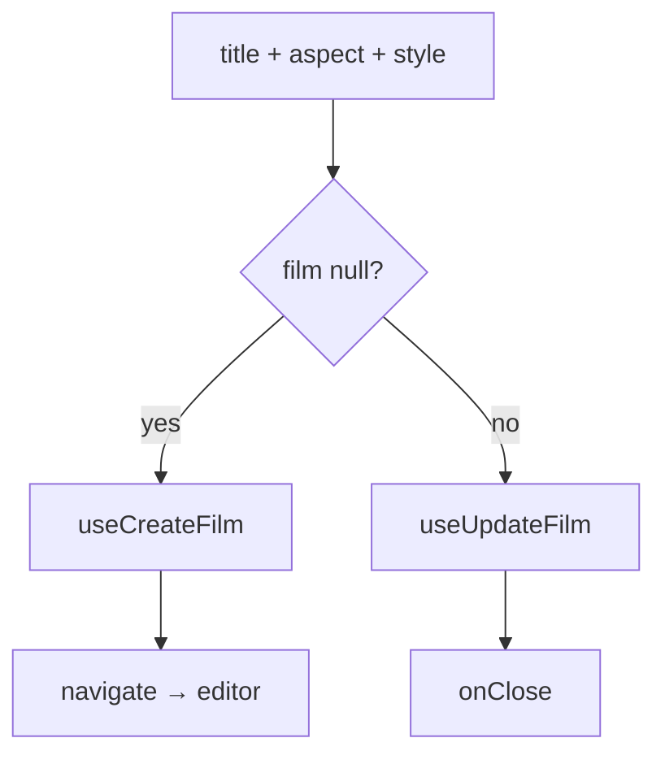

# FilmSettingsModal.tsx — AI component doc

> AI-facing sidecar for `FilmSettingsModal.tsx`. Created 2026-07-09. Keep this in sync with the code on every change.

## Purpose

Create-or-edit a film in one modal (Entities-editor pattern: null `film` =
create, a film = edit): title, canvas aspect, default style. On create it
navigates straight into the new film's editor.

## What it does (for an AI reader)

- Responsibilities: collect title/aspect/defaultStyle; call create or update.
- Public API / exports: `FilmSettingsModal`,
  `FilmSettingsModalProps = { film: Film | null, isOpen, onClose }`.
- Inputs → Outputs: form state → `CreateFilmInput` / `UpdateFilmInput`.
- Side effects: `useCreateFilm` / `useUpdateFilm` mutations; `useNavigate` (create → editor).

## Dependencies

- Imports: `@tanstack/react-router` (`useNavigate`), `react-i18next`,
  `aspectRatioSchema`, `shared/ui` (`Button`, `Input`, `Modal`, `PillGroup`,
  `Select`), `useCreateFilm`/`useUpdateFilm`, `STYLE_OPTIONS`.
- Used by: `CinemaLibrary` (create), `CinemaEditorHeader` (edit — the ⋯ "Film settings" item, for the style default now that title/aspect are inline).

## Diagram

## Key decisions / gotchas

- Style widens to `''` (no default) → mapped to `null` on the wire.
- Aspect is a `PillGroup` (a small closed set) rather than a Select.

## Commits

- _no commit yet_

## Update 2026-07-31 — default-style picker reads the registry
- Gains `styles?: readonly Style[] | undefined` and renders `styleOptions(styles, t)`.
  The film's DEFAULT style is what every new shot inherits, so a style the user wrote
  has to be offerable here (ADR style-studio D5).
- Reached from TWO places, so both routes now feed it: `CinemaEditorHeader` (edit
  mode, from `/cinema/$filmId`) and `CinemaLibrary` (create mode, from `/cinema`).
- The explicit `| undefined` in the prop type is required by `exactOptionalPropertyTypes`
  — both callers forward a value that may itself be undefined.
- The `'' → null` conversion on submit is unchanged: the picker widens, the wire wants
  null for "no default".

## Update 2026-07-31 — create and edit deliberately diverge
- **CREATE is now «name it, optionally pick a picture»**: the aspect `PillGroup` and the
  default-style `Select` are gone from create entirely (owner request). Neither is
  answerable before the film exists — the aspect is implied by shots that do not exist
  yet, and the default style is a per-shot decision the user has not reached. Both were
  being answered by shrugging at a default.
- **EDIT is untouched**, and that is the whole justification for the fork: by then the
  film is real and both questions are informed. This is the one place the file departs
  from the Entities create-or-edit pattern it otherwise follows.
- **The create body is now only what was asked for**: `{title}`, plus `{coverDataUri}`
  when one was picked. No `aspectRatio` — the SERVER owns that default (contracts
  film.ts), and two opinions about one field is how they drift. No `defaultStyleId`.
- **The cover is LOCAL until submit.** It rides the create body as bytes so "name it and
  pick a picture" is ONE request that cannot half-succeed; nothing is uploaded while the
  user is still deciding, and a rejected image means no film at all rather than a film
  with a broken cover. Click / drop / paste all go through the shared `readImageFile`
  gate; a reject is a localized `role="alert"` and no request.
- The `styles` prop stays on this component for EDIT mode (fed by CinemaEditorHeader).
  `CinemaLibrary` stopped passing it, because create no longer renders a style picker.
- Pinned by a new `FilmSettingsModal.test.tsx`: create has no aspect/style controls,
  create-without-cover sends exactly `{title}`, create-with-cover carries `coverDataUri`
  on the same request, the cover can be removed before submit, a non-image is refused
  locally — and edit still offers aspect and style.
