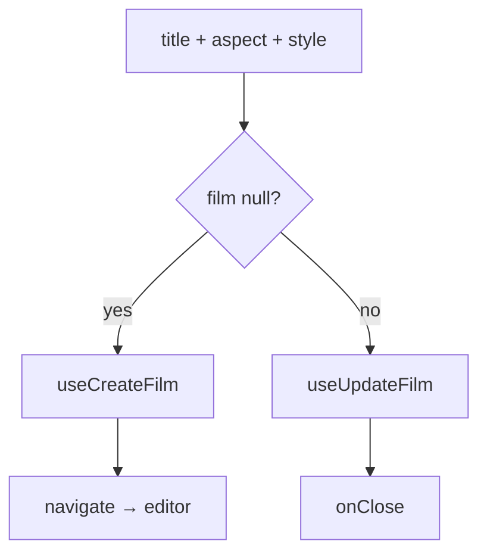

# FilmSettingsModal.tsx — AI component doc

> AI-facing sidecar for `FilmSettingsModal.tsx`. Created 2026-07-09. Keep this in sync with the code on every change.

## Purpose

Create-or-edit a film in one modal (Entities-editor pattern: null `film` =
create, a film = edit): title, canvas aspect, default style. On create it
navigates straight into the new film's editor.

## What it does (for an AI reader)

- Responsibilities: collect title/aspect/defaultStyle; call create or update.
- Public API / exports: `FilmSettingsModal`,
  `FilmSettingsModalProps = { film: Film | null, isOpen, onClose }`.
- Inputs → Outputs: form state → `CreateFilmInput` / `UpdateFilmInput`.
- Side effects: `useCreateFilm` / `useUpdateFilm` mutations; `useNavigate` (create → editor).

## Dependencies

- Imports: `@tanstack/react-router` (`useNavigate`), `react-i18next`,
  `aspectRatioSchema`, `shared/ui` (`Button`, `Input`, `Modal`, `PillGroup`,
  `Select`), `useCreateFilm`/`useUpdateFilm`, `STYLE_OPTIONS`.
- Used by: `CinemaLibrary` (create), `CinemaEditorHeader` (edit — the ⋯ "Film settings" item, for the style default now that title/aspect are inline).

## Diagram

## Key decisions / gotchas

- Style widens to `''` (no default) → mapped to `null` on the wire.
- Aspect is a `PillGroup` (a small closed set) rather than a Select.

## Commits

- _no commit yet_
