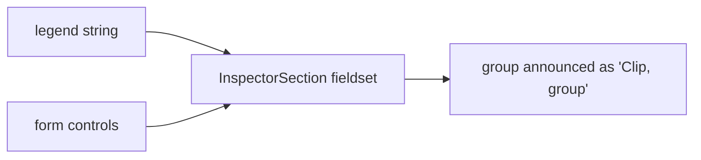

# InspectorSection.tsx — AI component doc

> AI-facing sidecar for `InspectorSection.tsx`. Created 2026-07-09. Keep this in sync with the code on every change.

## Purpose

One labelled group inside the shot inspector. It exists because the v3 inspector
was a single 247-line flat column of controls; this is the divider that turns it
into four readable concerns (prompt · look · clip · title card).

## What it does (for an AI reader)

- Responsibilities: render a `<fieldset>` + `<legend>` around a set of controls.
- Public API / exports: `InspectorSection`, `InspectorSectionProps = { legend, children }`.
- Inputs → Outputs: a group name + children → a labelled form group.
- Side effects: none (pure presentational).

## Dependencies

- Imports: `react` (`ReactNode` type only).
- Used by: `ShotInspector`.

## Diagram

## Key decisions / gotchas

- A real `<fieldset>/<legend>`, not a styled div: the grouping semantics are free
  from the platform, so no ARIA is re-implemented on top.
- `min-w-0` is load-bearing — a fieldset defaults to `min-content` width, which
  would stop the 2-col `Select` grids inside from shrinking in the 380px rail.

## Commits

- _no commit yet_
