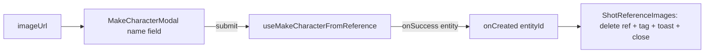

# MakeCharacterModal.tsx — AI component doc

> AI-facing sidecar for `MakeCharacterModal.tsx`. Created 2026-07-24. Keep this in sync with the code on every change.

## Purpose
A small naming dialog over ONE attached shot reference: the user gives the picture
a name and it becomes a reusable, `@`-mentionable `Entity` (character). It owns the
CREATE only; the parent (`ShotReferenceImages`) owns the shot-level effects on
success.

## What it does (for an AI reader)
- Responsibilities:
  - Collect a character name (1–80 chars, capped), preview the reference in a
    `well` plate, submit via `useMakeCharacterFromReference`.
  - Show the pending state (spinner, disabled submit) and a LOCALIZED failure
    notice; stay OPEN on error so the typed name is not lost.
- Public API / exports / props / endpoints:
  - `MakeCharacterModal({ imageUrl, onClose, onCreated })`.
  - `imageUrl: string` — the `/media` URL, previewed AND re-homed as the photo.
  - `onClose: () => void` — Escape / overlay / ✕ / Cancel.
  - `onCreated: (entityId: string) => void` — fired once the character exists.
- Inputs → Outputs: a typed name + the ref URL → an `onCreated(entityId)` callback
  (the parent handles the rest).
- Side effects (I/O, network, state): none directly; the mutation it drives does
  the POSTs + `fetch` + cache invalidation (see `makeCharacterApi.ts`).

## Dependencies
- Imports / depends on: `react` (`useState`), `react-i18next`,
  `shared/libs/apiClient` (`ApiClientError`), `shared/libs/errorCopy`
  (`errorCodeMessageKey`), `shared/ui` (`Button`, `Card`, `Input`, `Modal`),
  `../model/makeCharacterApi` (`useMakeCharacterFromReference`).
- Used by: `Cinema/components/ShotReferenceImages.tsx` (mounted while a reference
  is being converted).

## Diagram

## Key decisions / gotchas
- The modal NEVER closes itself on success — the parent closes it after wiring the
  delete/tag/toast, so a failed create simply leaves the dialog open with the name.
- Localized error only: `ApiClientError` → its code's copy; any other throw (a
  failed reference fetch) → `cinema.shotRef.makeCharacterError`.
- Reuses the shared `Modal` (focus trap / Escape / scroll lock) and `Input` (label
  is the accessible name — fields are never placeholder-only).

## Commits
- _no commit yet_
