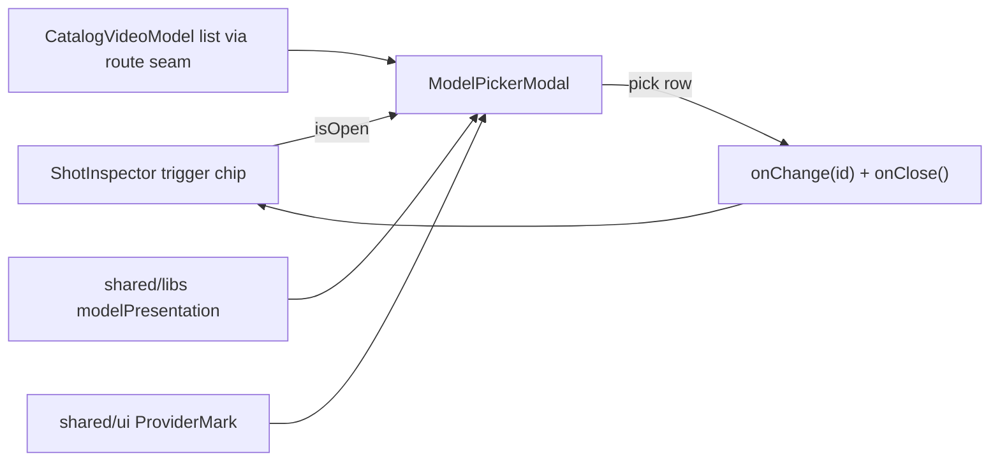

# ModelPickerModal.tsx — AI component doc

> AI-facing sidecar for `ModelPickerModal.tsx`. Created 2026-07-15. Keep this in sync with the code on every change.

## Purpose

The composer dock's model picker as a BIG `Modal` (owner request 2026-07-15):
one row per video model with brand mark, tier chip, honest provider label,
localized description and base tariff — a purchasing decision laid out in full,
instead of a cramped 22rem listbox panel.

## What it does (for an AI reader)

- Responsibilities: render the video-model list inside a `size="lg"` steel
  `Modal`; mark the chosen row amber; commit + close on pick.
- Public API / exports / props / endpoints: `ModelPickerModal`,
  `ModelPickerModalProps` (`isOpen`, `onClose`, `models: CatalogVideoModel[]`,
  `value`, `onChange`).
- Inputs → Outputs: catalog video models (route seam) → rich rows; click →
  `onChange(model.id)` then `onClose()` — the dialog is a question, not a
  workspace.
- Side effects (I/O, network, state): none — pure presentation; state lives in
  `ShotInspector`.

## Dependencies

- Imports / depends on: `react-i18next`, `@opencreate/contracts`
  (`CatalogVideoModel`), `shared/libs/modelPresentation` (`presentationFor`,
  `tariffFor`), `shared/ui` (`Modal`, `ProviderMark`).
- Used by: `ShotInspector` (the toolbar's model trigger chip opens it).
- i18n: reuses `cinema.inspector.model` (title), `generator.tier.*`,
  `generator.models.<id>.description`, `generator.model.tariff` — the same
  strings the Generator's select shows, so the two surfaces cannot disagree.

## Diagram

## Key decisions / gotchas

- Rows are real `<button>`s (accessible name = the row text), `aria-pressed`
  carries the selection; amber ring = the kit's selection language.
- `presentationFor`/`ProviderMark` were MOVED to shared (from
  modules/Generator) for this component — Cinema must not import Generator, and
  a static brand/description lookup carries no business logic.
- The list scrolls inside itself (`max-h-[60svh]`) so a long catalog never
  pushes the modal's close affordance off screen.

## Commits

- _no commit yet_
