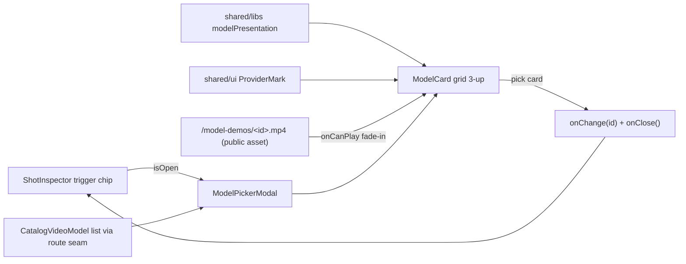

# ModelPickerModal.tsx — AI component doc

> AI-facing sidecar for `ModelPickerModal.tsx`. Created 2026-07-15. Keep this in sync with the code on every change.

## Purpose

The composer dock's model picker as a CARD GALLERY (owner request 2026-07-17,
replacing the 2026-07-15 row list): three cards to a row (`lg:grid-cols-3`,
responsive down to one), each led by a MINI DEMO — a real clip of that model's
own output looping silently over the card face. Below the demo plate: name,
base tariff, honest provider label, localized description; tier chip rides the
plate.

## What it does (for an AI reader)

- Responsibilities: render a `ModelCard` per video model in a grid inside a
  `size="lg"` steel `Modal`; mark the chosen card amber; commit + close on pick.
- Public API / exports / props / endpoints: `ModelPickerModal`,
  `ModelPickerModalProps` (`isOpen`, `onClose`, `models: CatalogVideoModel[]`,
  `value`, `onChange`). `ModelCard` is file-private.
- Inputs → Outputs: catalog video models (route seam) → demo cards; click →
  `onChange(model.id)` then `onClose()` — the dialog is a question, not a
  workspace.
- DEMO CONTRACT (self-serve): every card renders a muted looping
  `<video src="/model-demos/<model-id>.mp4">` (a `apps/web/public` asset —
  presentation, like the logos/descriptions). The branded plate (ProviderMark
  on abyss) is ALWAYS painted underneath; the video fades in via `onCanPlay`
  (`isDemoLive` state), so a missing/broken demo degrades to a clean branded
  card and dropping a new mp4 into `public/model-demos/` lights a card up with
  zero code changes. Demos ship for wan-2-7 and seedance-1-5-pro (3s 480p
  loops cut with ffmpeg-static from real local generations).
- Side effects (I/O, network, state): the demo `<video>` fetches
  (`preload="metadata"`); per-card `isDemoLive` state; selection state lives in
  `ShotInspector`.

## Dependencies

- Imports / depends on: `react-i18next`, `@opencreate/contracts`
  (`CatalogVideoModel`), `shared/libs/modelPresentation` (`presentationFor`,
  `tariffFor`), `shared/ui` (`Modal`, `ProviderMark`).
- Used by: `ShotInspector` (the toolbar's model trigger chip opens it).
- i18n: reuses `cinema.inspector.model` (title), `generator.tier.*`,
  `generator.models.<id>.description`, `generator.model.tariff` — the same
  strings the Generator's select shows, so the two surfaces cannot disagree.

## Diagram

## Key decisions / gotchas

- Cards are real `<button>`s (accessible name = the card text), `aria-pressed`
  carries the selection; amber ring = the kit's selection language; the whole
  card, demo included, is the click target.
- The demo plate is the media-well language (`bg-abyss`), NOT glass — media is
  the hero. Tier chip sits ON the plate in a `bg-void/70` pill so it reads over
  any footage. No gradients (v4 hard rule).
- `preload="metadata"` keeps a 12-model dialog from pulling 12 full files on
  open; `muted`+`playsInline` are what allow autoplay at all.
- `presentationFor`/`ProviderMark` were MOVED to shared (from
  modules/Generator) for this component — Cinema must not import Generator, and
  a static brand/description lookup carries no business logic.
- The grid scrolls inside itself (`max-h-[70svh]`) so a long catalog never
  pushes the modal's close affordance off screen.
- KNOWN HARNESS LIMIT: the claude-in-chrome automated tab cannot play ANY
  media (even blob-fed video sticks at readyState 0), so demo playback is
  verified by ffmpeg decode + HTTP 206 range checks, and visually only in a
  normal browser tab.

## Commits

- _no commit yet_
