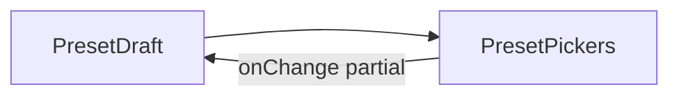

# PresetPickers.tsx — AI component doc

> AI-facing sidecar for `PresetPickers.tsx`. Created 2026-07-09. Keep this in sync with the code on every change.

## Purpose

The four structured prompt-preset pickers (style · framing · motion · quality)
rendered from the shared contract tables — the SAME tables the server composes
from, so a picker and the composition can never disagree (ADR §3).

## What it does (for an AI reader)

- Responsibilities: present the four axes as one controlled unit.
- Public API / exports: `PresetPickers`,
  `PresetPickersProps = { value: PresetDraft, onChange: (patch: Partial<PresetDraft>) => void }`.
- Inputs → Outputs: a `PresetDraft` → four `Select`s; each change reports a partial patch.
- Side effects: none (controlled).

## Dependencies

- Imports: `react-i18next`, `Select` from `shared/ui`, the option arrays +
  `PresetDraft`/`StyleChoice` types from `../model/presetOptions`.
- Used by: `ShotInspector`.

## Diagram

## Key decisions / gotchas

- `PresetDraft` lives in the MODEL (`presetOptions`), not here — the draft is
  data; the component only binds to it. Avoids a component→model type cycle.
- Style prepends a `''` "no style" row; the modifier axes carry their own 'none'.

## Commits

- _no commit yet_

## Change log (behaviour)

### 2026-07-12 — pickers translate their own labels
Now builds options via `styleOptions(t)` / `cameraShotOptions(t)` /
`cameraMotionOptions(t)` / `qualityOptions(t)` instead of importing the
constant arrays, whose labels came from `contracts/presets.ts` and were
hardcoded Russian regardless of the active language.
