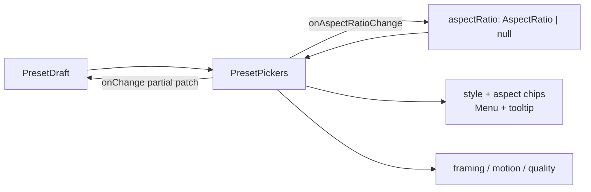

# PresetPickers.tsx — AI component doc

> AI-facing sidecar for `PresetPickers.tsx`. Created 2026-07-09. Keep this in sync with the code on every change.

## Purpose

The shot's LOOK controls: the four structured prompt-preset axes (style ·
framing · motion · quality) rendered from the shared contract tables — the SAME
tables the server composes from, so a picker and the composition can never
disagree (ADR §3) — plus the per-shot ASPECT RATIO override, which is not a
preset axis but belongs to the same visual decision (see the 2026-08-02 update).

## What it does (for an AI reader)

- Responsibilities: present the look axes as one controlled unit. Two registers:
  style + aspect are ICON CHIPS (`Menu` chip-dropdowns with tooltips), framing +
  motion + quality remain labelled `Select`s.
- Public API / exports: `PresetPickers`, `PresetPickersProps = { value:
  PresetDraft, onChange: (patch: Partial<PresetDraft>) => void, styles: readonly
  Style[], aspectRatio: AspectRatio | null, onAspectRatioChange: (aspectRatio:
  AspectRatio | null) => void }`.
- Inputs → Outputs: a `PresetDraft` + the shot's aspect override → two chips and
  three Selects; a preset change reports a PARTIAL patch, an aspect change
  reports the whole (nullable) value on its own callback.
- Side effects: none (fully controlled).

## Dependencies

- Imports: `react-i18next`, `aspectRatioSchema` + types from
  `@opencreate/contracts`, `Menu`/`Select` from `shared/ui`, the option arrays +
  `PresetDraft`/`StyleChoice` types from `../model/presetOptions`,
  `PaletteIcon`/`FrameIcon` from `./icons`.
- Used by: `ShotInspector` (its expand drawer's "Look" section) — the only
  consumer.

## Diagram

## Key decisions / gotchas

- `PresetDraft` lives in the MODEL (`presetOptions`), not here — the draft is
  data; the component only binds to it. Avoids a component→model type cycle.
- Style prepends a `''` "no style" row; the modifier axes carry their own 'none'.

## Commits

- _no commit yet_

## Change log (behaviour)

### 2026-07-12 — pickers translate their own labels
Now builds options via `styleOptions(t)` / `cameraShotOptions(t)` /
`cameraMotionOptions(t)` / `qualityOptions(t)` instead of importing the
constant arrays, whose labels came from `contracts/presets.ts` and were
hardcoded Russian regardless of the active language.

## Update 2026-07-31 — the style axis reads the registry
- `PresetPickersProps` gains `styles: readonly Style[]`, and the style `Select` now
  renders `styleOptions(styles, t)` instead of the builtin-only `styleOptions(t)`.
  Framing, motion and quality are untouched — they are still closed enums over the
  bundled contract tables.
- **Why a prop and not a hook:** the list comes from `GET /api/styles`, which lives
  in `modules/Styles`, and modules never import each other. It is read at the route
  (`cinema.$filmId`) and handed down — the same seam this editor already uses for
  the model catalog, the templates and the cast.
- **No loading/disabled state, deliberately.** An empty list can only mean "not
  loaded" (the registry always carries the seven builtins), and those builtins ship
  in the bundle, so `styleOptions` falls back to them. Disabling the picker for one
  request would remove function the user already has.
- The `''` no-style sentinel is still prepended HERE with translated copy: unlike
  the other three axes, `styleId` has no first-class 'none' in its own vocabulary.

## Update 2026-08-02 — style + aspect become icon chips
- **Style is no longer a `Select`.** It is a `Menu` chip-dropdown whose trigger is
  a `PaletteIcon` — no visible text (owner request: two icon controls with
  tooltips clear enough that it is obvious what they do). The accessible name is
  still `cinema.inspector.style`; the new `cinema.inspector.styleHint` is the
  `title` tooltip and says a style is a visual preset the SERVER blends into the
  prompt at generation time. Selection is marked with a leading check + a
  same-size spacer on the rest (design.md §13.3).
- **New: per-shot aspect ratio.** `aspectRatio` / `onAspectRatioChange` — a
  brand-new control, not a relabel; nothing at shot level offered this before.
  Options are `aspectRatioSchema.options` plus a leading "auto" row (`null` =
  `cinema.inspector.aspectAuto`, "Same as film"). `null` is a REAL value meaning
  "no opinion, inherit the film canvas", which is what every shot did before.
- **The frame icon IS the value.** `FrameIcon` draws the actual rectangle for the
  chosen ratio (dashed when inheriting), so an icon-only trigger still shows its
  own setting. The tooltip repeats it in words (`aspectHint — <value>`), because
  a glyph alone cannot say "9:16".
- **Amber = this shot deviates.** The aspect chip only lights (the composer's
  `TOOL_ON` tint) when an override is set; the style chip lights when a style is
  chosen. Same grammar as the cast/voice/audio toggles just below in the dock.
- **Why aspect lives in this file** despite the name: it never reaches
  `promptPreset` (it is a generation param resolved in `composeShotClipInput`),
  but it is part of the shot's look and the owner asked for the two chips as one
  pair. It is kept OUT of `PresetDraft` — separate prop, separate callback — so
  the preset draft stays exactly the four preset axes.
- Layout: the two chips sit in a row ABOVE the remaining three Selects, still
  inside `ShotInspector`'s existing "Look" section in the expand drawer. Nothing
  moved out of the drawer.
