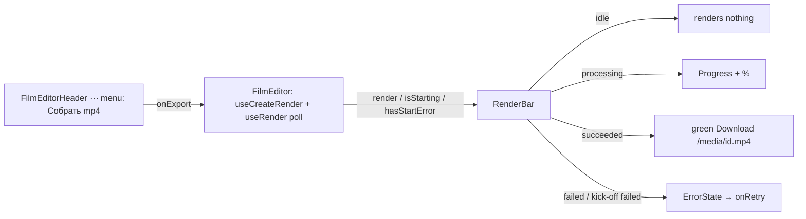

# RenderBar.tsx — AI component doc

> AI-facing sidecar for `RenderBar.tsx`. Created 2026-07-09. Keep this in sync with the code on every change.

## Purpose

The export STATUS STRIP (v7): renders NOTHING while idle — the "Собрать mp4"
trigger moved into the film header's ⋯ menu (owner request 2026-07-16), and this
strip appears only while an export is starting/processing/finished, carrying its
progress, the green Download link, or a calm retry.

## What it does (for an AI reader)

- Responsibilities: present the tracked render's lifecycle. PURE since v7 — no
  mutation, no polling; the row arrives as a prop.
- Public API / exports / props: `RenderBar`, `RenderBarProps`
  (`render: FilmRender | undefined`, `isStarting`, `hasStartError`,
  `onRetry: () => void`).
- Inputs → Outputs: idle (no render, not starting, no error) → `null`;
  starting/processing → `Progress` + amber percent (`role="status"`);
  succeeded → green Download link to `/media/<id>.mp4`; failed render OR failed
  kick-off → `ErrorState` with `onRetry` (never raw ffmpeg/server text).
- Side effects: none.

## Dependencies

- Imports: `react-i18next`, `@opencreate/contracts` (`FilmRender`),
  `shared/ui` (`Card`, `ErrorState`, `Progress`), `DownloadIcon`.
- Used by: `FilmEditor` — which OWNS the kick-off mutation (`useCreateRender`),
  the tracked `renderId` and the poll (`useRender`), because the header menu
  needs the same state to hide "Собрать mp4" while one is in flight.
- Tested by: `RenderBar.test.tsx` (pure: idle=null, processing, download,
  retry fires onRetry).

## Diagram

## Key decisions / gotchas

- **v7: the standing card is gone.** A block that exists to hold one button is
  chrome; a strip that appears WITH the work and carries its progress/result is
  information. Idle = `null`, so the stage owns the pixels back.
- **Pure on purpose:** the kick-off and the poll moved up to `FilmEditor` — the
  ⋯ menu (hide while in flight, via `MenuItem.isAvailable`) and this strip must
  read ONE state, and the component that owns none of the triggers cannot own it.
- Failure copy stays localized and calm — the raw ffmpeg tail never reaches the
  user (2026-07-12 finding).

## Commits

- _no commit yet (v7 rework)_
