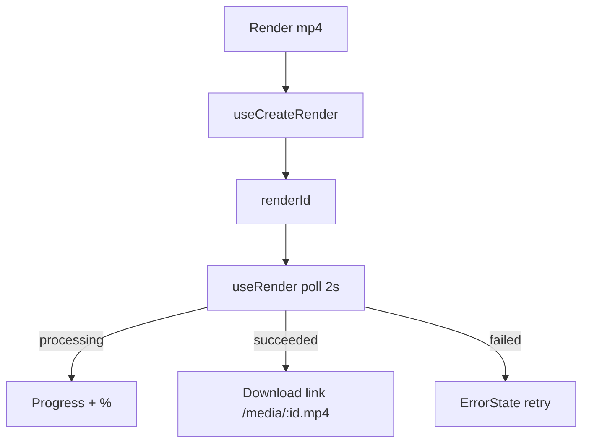

# RenderBar.tsx — AI component doc

> AI-facing sidecar for `RenderBar.tsx`. Created 2026-07-09. Keep this in sync with the code on every change.

## Purpose

The export control: POST a render (202 processing), poll it, then show a Download
link (succeeded) or a calm localized retry (failed). Owns the active render id.

v4: an ACTION BAR, not a panel — one glass row (caption + the green pill) that
only grows when a render is running or has finished.

## What it does (for an AI reader)

- Responsibilities: kick + poll + surface a render; disable while in flight.
- Public API / exports: `RenderBar`, `RenderBarProps = { filmId, canRender }`.
- Inputs → Outputs: click → render lifecycle → download link / retry.
- Side effects: `useCreateRender`, `useRender` (poll).

## Dependencies

- Imports: `react` (`useState`), `react-i18next`, `shared/ui`
  (`Button`, `Card`, `ErrorState`, `Progress`), `useCreateRender`/`useRender`,
  `DownloadIcon`.
- Used by: `FilmEditor` (under the stage).
- Tested by: `RenderBar.test.tsx`.

## Diagram

## Key decisions / gotchas

- An untitled `Card` (glass) holding one row. A TITLED card here would have given
  the export button the same visual weight as the video above it — the exact
  flatness v4 set out to fix. The `<section aria-label>` still names the region.
- Glass, not steel: it floats over the stage's dark well and the specular top
  edge of `GLASS_SURFACE` is what separates the two.
- Never renders the raw `errorMessage` — failed shows a localized calm retry.
- Disabled when `canRender` is false (no shots) or while processing — the honest
  client mirror of the API's concurrency cap.

## Update 2026-07-15 — v5 compact bar
- Caption text-sm→text-xs, CTA `size="sm"`, download link min-h-10 px-5 py-2 text-sm →
  min-h-8 px-4 py-1 text-xs — the export row is tool chrome on the same 32px scale as
  the timeline's authoring buttons.

## Commits

- _no commit yet_
