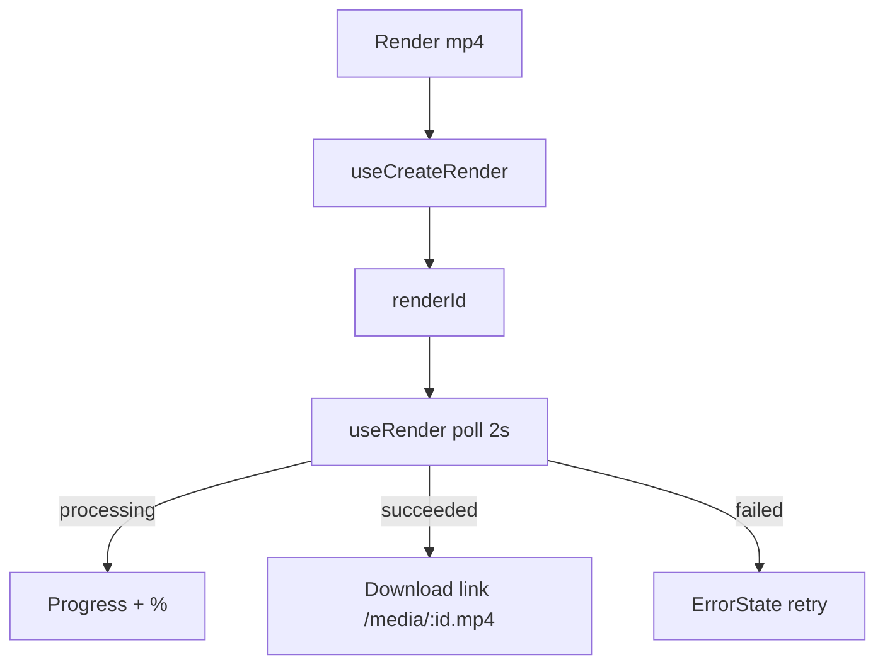

# RenderBar.tsx — AI component doc

> AI-facing sidecar for `RenderBar.tsx`. Created 2026-07-09. Keep this in sync with the code on every change.

## Purpose

The export control: POST a render (202 processing), poll it, then show a Download
link (succeeded) or a calm localized retry (failed). Owns the active render id.

## What it does (for an AI reader)

- Responsibilities: kick + poll + surface a render; disable while in flight.
- Public API / exports: `RenderBar`, `RenderBarProps = { filmId, canRender }`.
- Inputs → Outputs: click → render lifecycle → download link / retry.
- Side effects: `useCreateRender`, `useRender` (poll).

## Dependencies

- Imports: `react` (`useState`), `react-i18next`, `shared/ui`
  (`Button`, `ErrorState`, `Progress`), `useCreateRender`/`useRender`, `DownloadIcon`.
- Used by: `FilmEditor`.

## Diagram

## Key decisions / gotchas

- Never renders the raw `errorMessage` — failed shows a localized calm retry.
- Disabled when `canRender` is false (no shots) or while processing — the honest
  client mirror of the API's concurrency cap.

## Commits

- _no commit yet_
