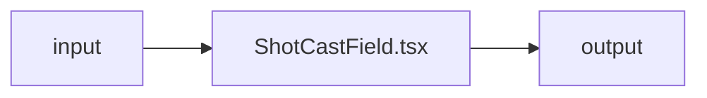

# ShotCastField.tsx — AI component doc

> AI-facing sidecar for `ShotCastField.tsx`. Created 2026-07-12. Keep this in sync with the code on every change.

## Purpose
_What this file/component is and why it exists (one or two sentences)._

## What it does (for an AI reader)
- Responsibilities:
- Public API / exports / props / endpoints:
- Inputs → Outputs:
- Side effects (I/O, network, state):

## Dependencies
- Imports / depends on:
- Used by:

## Diagram

## Key decisions / gotchas
-

## Update 2026-07-24 — no captions, no gating copy
- The `modelSupportsReferences` prop and the model-gating strings
  (`cinema.cast.unsupported`, `cinema.cast.unsupportedWarning`) are GONE (owner
  request: never show such copy).
- The "no characters yet — add one in Entities" empty hint (`cinema.cast.empty`)
  is ALSO gone (owner request 2026-07-24, second pass) — the row simply renders the
  add menu when something is taggable, and NOTHING when it is not. The state chain is
  now just `atCap || taggable.length === 0 ? null : menu`. All three keys
  (`unsupported`, `unsupportedWarning`, `empty`) were deleted from en+ru.
- The visible "Персонажи" section legend was also dropped in `ShotInspector` (the
  cast drawer no longer wraps this control in an `InspectorSection`). `cinema.cast.title`
  survives only as the toolbar toggle's aria-label. Tagging is always offered; whether
  a reference reaches the provider is `composeShotClipInput`'s decision.

## Update 2026-07-24 — CastableEntity carries a thumbnail
- `CastableEntity` gained optional `imageUrl` (the entity's primary reference
  photo, derived by the route) — consumed by ShotInspector's inline "@" picker;
  THIS field ignores it and still renders name chips only.

## Commits
- _no commit yet_
