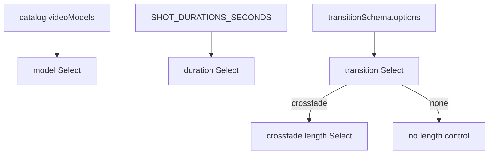

# ShotClipFields.tsx — AI component doc

> AI-facing sidecar for `ShotClipFields.tsx`. Created 2026-07-09. Keep this in sync with the code on every change.

## Purpose

The "Clip" group of the shot inspector: which video model generates the shot, how
long it runs, and how it transitions in. Extracted from `ShotInspector` so that
file stays an orchestrator under the 200-line ceiling — these Selects are one
concern (the mechanics of the clip) and always change together.

## What it does (for an AI reader)

- Responsibilities: render the model / duration / transition / crossfade-length
  `Select`s. Fully controlled; holds no state.
- Public API / exports: `ShotClipFields`, `ShotClipFieldsProps =
  { videoModels, modelId, onModelChange, seconds, onSecondsChange, transition,
  onTransitionChange, transitionMs, onTransitionMsChange }`.
- Inputs → Outputs: draft values → change callbacks the inspector folds into its
  one `UpdateShotInput` patch.
- Side effects: none.

## Dependencies

- Imports: `react-i18next`, `transitionSchema` + `CatalogVideoModel`/`Transition`
  types from `@opencreate/contracts`, `Select` from `shared/ui`,
  `SHOT_DURATIONS_SECONDS` from `../model/presetOptions`.
- Used by: `ShotInspector` (inside an `InspectorSection` legend "Clip").

## Diagram

## Key decisions / gotchas

- The crossfade-length `Select` renders ONLY for `transition === 'crossfade'` —
  a disabled control the user cannot use is worse than no control.
- Duration and transition-length values are strings because `Select` is a string
  listbox; the inspector converts them to ms when it builds the patch.
- `CROSSFADE_MS` lives here (not in the contract) — it is a UI affordance, not a
  wire constraint; the server accepts any 0–5000ms.

## Commits

- _no commit yet_
