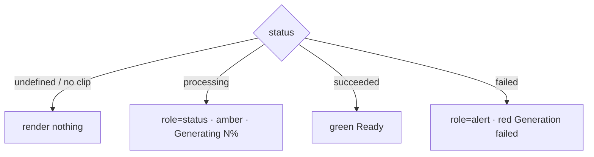

# ShotClipStatus.tsx — AI component doc

> AI-facing sidecar for `ShotClipStatus.tsx`. Created 2026-07-09. Keep this in sync with the code on every change.

## Purpose

The one-line live status of the selected shot's clip (generating / ready /
failed), extracted from `ShotInspector` so that file stays an orchestrator under
the 200-line ceiling.

## What it does (for an AI reader)

- Responsibilities: turn a generation status + progress into one localized line.
- Public API / exports: `ShotClipStatus`,
  `ShotClipStatusProps = { status, progress, hasClip }`.
- Inputs → Outputs: cached generation status → a `role="status"` / `role="alert"` line.
- Side effects: none — the caller owns the `useShotGeneration` query.

## Dependencies

- Imports: `react-i18next`.
- Used by: `ShotInspector`.

## Diagram

## Key decisions / gotchas

- Status is never color-only (design.md §8) — the word carries it, the triad glow
  only reinforces.
- Failure is `role="alert"` (assertive) because it cost the user credits;
  in-flight progress is `role="status"` (polite).

## Commits

- _no commit yet_
