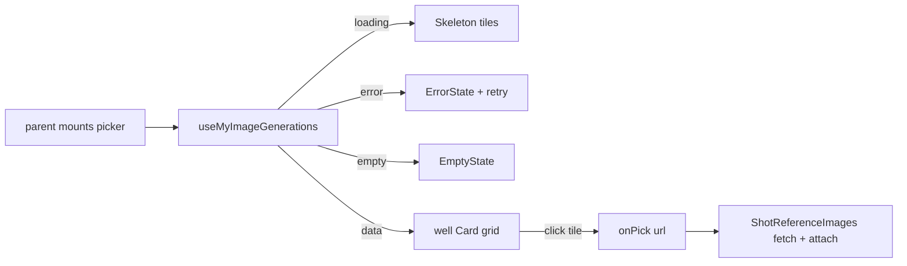

# ShotGalleryPicker.tsx — AI component doc

> AI-facing sidecar for `Cinema/components/ShotGalleryPicker.tsx`. Created 2026-07-24. Keep this in sync with the code on every change.

## Purpose
Modal grid that lets a user attach a shot reference by picking one of THEIR OWN
finished images ("attach from gallery"), alongside the existing click/drop/paste
upload. It only chooses a `/media` URL and hands it up; the parent
(`ShotReferenceImages`) does the fetch → data-URI → attach.

## What it does (for an AI reader)
- Responsibilities:
  - Render `useMyImageGenerations()` as a thumbnail grid inside a `Modal`.
  - Handle all 4 UI states: Loading (Skeleton tiles), Empty (quiet hint), Error
    (localized message + retry), Data (pickable grid).
  - On a tile click, call `onPick(url)` — the parent closes the picker & attaches.
- Public API / exports / props / endpoints:
  - Props: `{ onClose: () => void; onPick: (url: string) => void }`.
  - No endpoints of its own — data comes via `useMyImageGenerations`
    (`GET /api/generations?limit=50`).
- Inputs → Outputs: (open) → the user picks a tile → `onPick(image.url)`.
- Side effects (I/O, network, state): the gallery GET runs on MOUNT. The parent
  mounts this ONLY while the picker is open (lazy), so the reference control
  itself fires no generations request.

## Dependencies
- Imports / depends on: `react-i18next`, `shared/ui`
  (`Card`, `EmptyState`, `ErrorState`, `Modal`, `Skeleton`),
  `../model/galleryImagesApi` (`useMyImageGenerations`).
- Used by: `Cinema/components/ShotReferenceImages.tsx` (rendered when its
  gallery trigger opens the picker).

## Diagram

## Key decisions / gotchas
- LAZY BY MOUNT: `isOpen` is hardcoded on the `Modal` because the component only
  exists while open; the parent's `{isPickerOpen ? <ShotGalleryPicker/> : null}`
  is what gates the query. This is why mounting `ShotReferenceImages` (all its
  existing tests) fires no `GET /api/generations`.
- Each tile is a `<button>` (keyboard + AT); the `` is `alt=""` decorative
  because the button's `aria-label` (`galleryPick`) is the accessible name.
- Media sits in a `well` Card — the recessed plate reserved for user media
  (design.md), never a frosted/glass surface.
- The picker never touches the mutation or the shared budget of 5 — it only
  emits a URL; attaching (and cap enforcement) stays in `ShotReferenceImages`.

## Commits
- _no commit yet_
