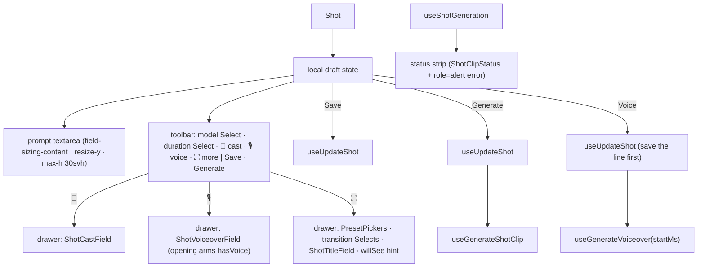

# ShotInspector.tsx — AI component doc

> AI-facing sidecar for `ShotInspector.tsx`. Created 2026-07-09. Keep this in sync with the code on every change.

## Purpose

The selected shot's editor, v6: a COMPOSER DOCK fixed to the bottom of the
viewport (`fixed inset-x-0 bottom-0 z-30`, opaque steel sheet, max-w-4xl). Its
face is an auto-growing, hand-resizable prompt textarea; a toolbar carries the
everyday dials (model + duration pickers) and three icon toggles — cast
(paperclip), spoken line (mic), expand — each opening a DRAWER above the prompt
with the folded controls (cast field / voice field / look presets + transition +
title card + "model will see" hint). Save / Generate sit on the toolbar's right.

## What it does (for an AI reader)

- Responsibilities: hold the shot draft (keyed by shot.id upstream), persist
  edits, generate+link the clip, and voice the shot's line. Orchestrator — the
  sub-forms and the status line live in their own files.
- Public API / exports: `ShotInspector`, `ShotInspectorProps`
  (`filmId`, `shot`, `filmAspect`, `videoModels`, `ttsModel`, `entities`,
  `startMs`, `isVoiced`).
- Inputs → Outputs: a `Shot` → local draft → `UpdateShotInput` (save), a
  `Generation` (generate), a `FilmAudio` track (voice).
- Side effects: `useUpdateShot`, `useGenerateShotClip`, `useShotGeneration`
  (status line), `useGenerateVoiceover` (charges credits). Local UI state:
  `openPanel: 'cast' | 'voice' | 'more' | null` (one drawer at a time).

## Dependencies

- Imports: `react-i18next`, `applyPromptPreset` + `STYLE_PRESETS` +
  `transitionSchema` from `@opencreate/contracts`, `shared/ui` (`Button`,
  `Select`), model hooks (`useUpdateShot`, `useGenerateShotClip`,
  `useShotGeneration`, `useGenerateVoiceover`), preset helpers,
  `InspectorSection`, `PresetPickers`, `ShotCastField`, `ShotClipStatus`,
  `ShotTitleField`, `ShotVoiceoverField`, icons (`ExpandIcon`, `MicIcon`,
  `PaperclipIcon`, `SparkIcon`).
- Used by: `FilmEditor` (rendered with `key={shot.id}`; computes `startMs` and
  `isVoiced`; renders its own slim hint dock when no shot is selected).
- Tested by: `ShotInspector.test.tsx` (prompt+save PATCH body, toolbar pickers,
  drawer toggles incl. aria-pressed, Generate gating, voice tool visibility).

## Diagram

## Key decisions / gotchas

- **v6 dock, why:** the v4/v5 side rail (360px sticky) was the one column
  fighting the preview for width, and a long prompt lived in a cramped corner
  box. A bottom dock is the shape prompt-first tools train users on: type below,
  result above. The editor body keeps bottom padding so nothing hides beneath.
- **Prompt sizing:** `field-sizing-content` auto-grows with the text (Tailwind
  v4 utility), `resize-y` hands the user manual control, `max-h-[30svh]` caps it
  so a pasted novella never eats the stage. `min-h-10` keeps a one-line dock.
- **One drawer at a time** (`openPanel`): two open panels would push the
  textarea off the dock. Toggles are amber while open (`aria-pressed` carries
  the state). Model+duration stay ON the toolbar — they are everyday dials;
  transition moved into the expand drawer (its Selects are inlined here since
  `ShotClipFields` was deleted with the v6 rework).
- **Mic toggle ARMS the line:** opening the voice drawer sets `hasVoice=true` —
  the user clicked a mic, not a settings gear; a second "enable" pill first
  would be a hoop. Closing the drawer does not disarm.
- The dock is OPAQUE steel (not glass): the stage scrolls behind it and the
  prompt must stay readable over moving media. z-30 — under Modal (overlays),
  over page content.
- Keyed by `shot.id` upstream → no `useEffect` sync; a new selection re-inits.
- Generate SAVES first (chained via `onSuccess`, no floating async) so the
  composed request is built from persisted edits; generate's own PATCH only sets
  `generationId`.
- The preset stays STRUCTURED to the wire; the willSee hint (expand drawer)
  previews what the server will compose.

## Key decisions (2026-07-11) — template catalog

- **`initialModelId(shot, videoModels)`** — picker opens on: (1) the pinned
  `shot.modelId`; (2) the style's `recommendedModelId`; (3) the first video
  model. `buildPatch()` persists `modelId`.
- **Voice has its OWN action and its own charge**; hidden when no tts model.
- **`handleVoice` SAVES the line first, then voices it**; `isVoicing` spans both
  legs of the chain (double-click between them would be a double charge).
- `startMs` / `isVoiced` are computed by `FilmEditor` and passed in.

## Change log (behaviour)

### 2026-07-12 — a failed Generate is no longer invisible
`actionErrorCode` derives from the newest failure across the three mutations
(generate first — it spends credits) and renders as a `role="alert"` line keyed
off the machine code via `errorCodeMessageKey` — never raw server text.

### 2026-07-15 — v6 composer dock
Presentation reworked from the rail Card into the fixed bottom dock described
above. All v5 controls survive: prompt (now auto-growing + resizable), cast,
look presets, model, duration, transition (+crossfade length), title card,
voice, status strip, Save/Generate. Behaviour (save-then-generate chaining,
error surfacing, money-path guards) unchanged.

## Update 2026-07-15 — generation-audio toggle
- New toolbar STATE toggle (SpeakerIcon, first in the icon row): amber = the
  clip generates WITH the model's own soundtrack and the film keeps it. The
  aria-label carries the price on switchable models (`cinema.inspector.audioX2`,
  "×2" — money never hides); disabled + `audioNone` title when the model has no
  `nativeAudio`. Draft state `audioOn` (init from `shot.audio`) rides
  `buildPatch()` AND the Generate draftShot (composeShotClipInput reads
  shot.audio — generating from the pre-edit value would bill the wrong price).

## Commits

- _no commit yet_
