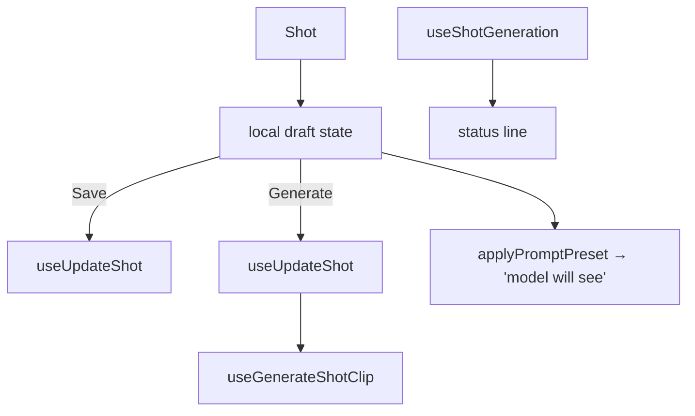

# ShotInspector.tsx — AI component doc

> AI-facing sidecar for `ShotInspector.tsx`. Created 2026-07-09. Keep this in sync with the code on every change.

## Purpose

The selected shot's editor: prompt, structured preset pickers, video-model
picker, duration/transition/title controls, a live "what the model will see"
hint, and the Save / Generate actions.

## What it does (for an AI reader)

- Responsibilities: hold the shot draft (keyed by shot.id upstream), persist
  edits, and generate+link the clip.
- Public API / exports: `ShotInspector`, `ShotInspectorProps`
  (`filmId`, `shot`, `filmAspect`, `videoModels`).
- Inputs → Outputs: a `Shot` → local draft → `UpdateShotInput` (save) and a
  `Generation` (generate).
- Side effects: `useUpdateShot`, `useGenerateShotClip`, `useShotGeneration` (status line).

## Dependencies

- Imports: `react-i18next`, `applyPromptPreset` + schemas from
  `@opencreate/contracts`, `shared/ui` (`Button`, `Select`), model hooks,
  preset helpers, `PresetPickers`, `SparkIcon`.
- Used by: `FilmEditor` (rendered with `key={shot.id}`).

## Diagram

## Key decisions / gotchas

- Keyed by `shot.id` upstream → no `useEffect` sync; a new selection re-inits.
- Generate SAVES first (chained via `onSuccess`, no floating async) so the
  composed request is built from persisted edits; generate's own PATCH only sets
  `generationId`.
- The preset stays STRUCTURED to the wire; the hint just previews what the server
  will compose.

## Commits

- _no commit yet_
