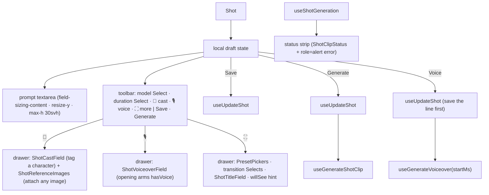

# ShotInspector.tsx — AI component doc

> AI-facing sidecar for `ShotInspector.tsx`. Created 2026-07-09. Keep this in sync with the code on every change.

## Purpose

The selected shot's editor, v6: a COMPOSER DOCK fixed to the bottom of the
viewport (`fixed inset-x-0 bottom-0 z-30`, opaque steel sheet, max-w-4xl). Its
face is an auto-growing, hand-resizable prompt textarea; a toolbar carries the
everyday dials — a label-less model TRIGGER CHIP (brand mark + current name,
opens the big `ModelPickerModal`) and a label-less stepped duration RANGE
slider over the editorial stops — and four icon toggles (speaker = generation
audio state) — cast
(paperclip), spoken line (mic), expand — each opening a DRAWER above the prompt
with the folded controls (cast field / voice field / look presets + transition +
title card + "model will see" hint). Save / Generate sit on the toolbar's right.

## What it does (for an AI reader)

- Responsibilities: hold the shot draft (keyed by shot.id upstream), persist
  edits, generate+link the clip, and voice the shot's line. Orchestrator — the
  sub-forms and the status line live in their own files.
- Public API / exports: `ShotInspector`, `ShotInspectorProps`
  (`filmId`, `shot`, `filmAspect`, `videoModels`, `ttsModel`, `entities`,
  `startMs`, `isVoiced`).
- Inputs → Outputs: a `Shot` → local draft → `UpdateShotInput` (save), a
  `Generation` (generate), a `FilmAudio` track (voice).
- Side effects: `useUpdateShot`, `useGenerateShotClip`, `useShotGeneration`
  (status line), `useGenerateVoiceover` (charges credits). Local UI state:
  `openPanel: 'cast' | 'voice' | 'more' | null` (one drawer at a time).

## Dependencies

- Imports: `react-i18next`, `applyPromptPreset` + `STYLE_PRESETS` +
  `transitionSchema` from `@opencreate/contracts`, `shared/ui` (`Button`,
  `EnhanceButton`, `Select`), model hooks (`useUpdateShot`, `useGenerateShotClip`,
  `useShotGeneration`, `useGenerateVoiceover`), preset helpers,
  `InspectorSection`, `PresetPickers`, `ShotCastField`, `ShotReferenceImages`,
  `ShotClipStatus`, `ShotTitleField`, `ShotVoiceoverField`, icons (`ExpandIcon`,
  `MicIcon`, `PaperclipIcon`, `SparkIcon`).
- Used by: `FilmEditor` (rendered with `key={shot.id}`; computes `startMs` and
  `isVoiced`; renders its own slim hint dock when no shot is selected).
- Tested by: `ShotInspector.test.tsx` (prompt+save PATCH body, toolbar pickers,
  drawer toggles incl. aria-pressed, Generate gating, voice tool visibility).

## Diagram

## Key decisions / gotchas
- **`resolveBuiltinStyle`, never `STYLE_PRESETS[id]`** (ADR style-studio, 2026-07-31). `styleId` is an
  open string now, so a shot may hold a USER style id this table has never heard of; indexing it
  directly is both a type error and a runtime `undefined`. Two places changed: the model
  recommendation (`initialModelId`) falls through to the next-best guess when the style is not
  builtin, and `composedHint` passes the resolved fragments as `applyPromptPreset`'s third argument
  because the function no longer looks styles up itself.
- **Known gap until the picker migration:** a USER style's fragment is missing from the composed HINT
  (client-side resolution only knows builtins). The server still applies it — the hint under-reports,
  it never mis-reports. Closing it needs the async `GET /api/styles` list.

- **v6 dock, why:** the v4/v5 side rail (360px sticky) was the one column
  fighting the preview for width, and a long prompt lived in a cramped corner
  box. A bottom dock is the shape prompt-first tools train users on: type below,
  result above. The editor body keeps bottom padding so nothing hides beneath.
- **Prompt sizing:** `field-sizing-content` auto-grows with the text (Tailwind
  v4 utility), `resize-y` hands the user manual control, `max-h-[30svh]` caps it
  so a pasted novella never eats the stage. `min-h-10` keeps a one-line dock.
- **One drawer at a time** (`openPanel`): two open panels would push the
  textarea off the dock. Toggles are amber while open (`aria-pressed` carries
  the state). Model+duration stay ON the toolbar — they are everyday dials;
  transition moved into the expand drawer (its Selects are inlined here since
  `ShotClipFields` was deleted with the v6 rework).
- **Mic toggle ARMS the line:** opening the voice drawer sets `hasVoice=true` —
  the user clicked a mic, not a settings gear; a second "enable" pill first
  would be a hoop. Closing the drawer does not disarm.
- The dock is OPAQUE steel (not glass): the stage scrolls behind it and the
  prompt must stay readable over moving media. z-30 — under Modal (overlays),
  over page content.
- Keyed by `shot.id` upstream → no `useEffect` sync; a new selection re-inits.
- Generate SAVES first (chained via `onSuccess`, no floating async) so the
  composed request is built from persisted edits; generate's own PATCH only sets
  `generationId`.
- The preset stays STRUCTURED to the wire; the willSee hint (expand drawer)
  previews what the server will compose.

## Key decisions (2026-07-11) — template catalog

- **`initialModelId(shot, videoModels)`** — picker opens on: (1) the pinned
  `shot.modelId`; (2) the style's `recommendedModelId`; (3) the first video
  model. `buildPatch()` persists `modelId`.
- **Voice has its OWN action and its own charge**; hidden when no tts model.
- **`handleVoice` SAVES the line first, then voices it**; `isVoicing` spans both
  legs of the chain (double-click between them would be a double charge).
- `startMs` / `isVoiced` are computed by `FilmEditor` and passed in.

## Change log (behaviour)

### 2026-07-12 — a failed Generate is no longer invisible
`actionErrorCode` derives from the newest failure across the three mutations
(generate first — it spends credits) and renders as a `role="alert"` line keyed
off the machine code via `errorCodeMessageKey` — never raw server text.

### 2026-07-15 — v6 composer dock
Presentation reworked from the rail Card into the fixed bottom dock described
above. All v5 controls survive: prompt (now auto-growing + resizable), cast,
look presets, model, duration, transition (+crossfade length), title card,
voice, status strip, Save/Generate. Behaviour (save-then-generate chaining,
error surfacing, money-path guards) unchanged.

## Update 2026-07-15 — generation-audio toggle
- New toolbar STATE toggle (SpeakerIcon, first in the icon row): amber = the
  clip generates WITH the model's own soundtrack and the film keeps it. The
  aria-label carries the price on switchable models (`cinema.inspector.audioX2`,
  "×2" — money never hides); disabled + `audioNone` title when the model has no
  `nativeAudio`. Draft state `audioOn` (init from `shot.audio`) rides
  `buildPatch()` AND the Generate draftShot (composeShotClipInput reads
  shot.audio — generating from the pre-edit value would bill the wrong price).

## Update 2026-07-15 — v6.1: glass prompt, model modal, duration slider
- The prompt textarea is an iOS-GLASS plate (`GLASS_SURFACE` from the kit:
  translucent wash + backdrop blur/saturate + bright specular TOP edge — the
  no-gradient "reflection" — + inner ring), floating `mx-2 mt-2` inside the
  steel dock. One material recipe with Card/Modal, so nothing drifts.
- The toolbar lost its visible labels (owner request): the model control is a
  chip showing the CURRENT model (ProviderMark + name + ▾, `aria-label`
  "Model") that opens `ModelPickerModal` — a purchase deserves the full table
  (logo/tier/provider/description/tariff), not a rail Select; duration is a
  stepped `<input type=range>` whose VALUE IS THE INDEX into
  `SHOT_DURATIONS_SECONDS` (every notch a real, priceable stop),
  `aria-valuetext` speaks the seconds, a chip beside shows them.
- `presentationFor` + `ProviderMark` now come from shared (moved out of
  Generator for exactly this cross-module reuse). Transition Selects in the ⛶
  drawer are unchanged.

## Update 2026-07-15 — v6.2: prompt grows UPWARD
- Native `resize-y` is GONE from the prompt: its handle grew the field by
  dragging DOWN, and the dock is pinned to the viewport bottom — growth can
  only travel up, so the gesture fought the layout (owner report).
- A grip now sits on the prompt's TOP edge — the same keyboard-operable
  `role="separator"` anatomy as the timeline's height edge: drag UP = grow,
  drag DOWN = shrink (pointer capture, 1:1 delta), ArrowUp/ArrowDown ±16px
  (clamped 40–480), double-click returns to AUTO.
- Two sizing modes: `promptHeight === null` = AUTO (`field-sizing-content`
  follows the text, `max-h-[30svh]` cap); a number = manual — the explicit
  height wins and the auto classes step aside so they cannot fight it. The
  first drag starts from the element's LIVE height (`offsetHeight`), so the
  grip picks up exactly what the user sees.

## Update 2026-07-16 — v7: plain flow element
- The fixed bottom shell is GONE: the composer is a plain section inside
  FilmEditor's bottom workbench (above the tracks); the editor column owns the
  viewport pinning now, so the z-index/clearance games died with it.

## Update 2026-07-21 — AI enhance in the prompt field
- The shared `EnhanceButton` (`shared/ui`, over the `shared/model` enhance hook)
  docks in the prompt field's BOTTOM-RIGHT corner: the textarea is wrapped in a
  `relative` div, gains `pr-12` to keep long text out from under the icon, and
  the button rides an `absolute bottom-2 right-2` wrapper (kept separate so the
  button's own `relative` container still anchors its floating nudge/error).
- Enhance/undo is just another `setPrompt`, so the cast `[[eN]]` tokens, the
  resize grip and the save/generate money-path are untouched. Same component as
  the /create composer — no cross-module import, no duplicate.

## Update 2026-07-22 — a failed clip now raises a TOAST + soften/retry
- `useShotFailureToast({ generation: clip.data, onSoften: handleSoftenRetry })`
  raises ONE toast the first time the selected shot's polled clip is seen
  `failed` (deduped per generationId). The inline `ShotClipStatus` line stays as
  the quiet record; the toast is the attention-grabber (the user may have paid
  for the clip then scrolled away). content_blocked gets rich copy + a soften
  action; other codes get the mapped reason. The existing `actionErrorCode`
  inline line (SUBMIT failure) is untouched — belt + braces.
- `handleGenerate` now delegates to `generateWithPrompt(promptText)` (save →
  generate against an EXPLICIT prompt). `buildPatch(promptText = prompt)` gained
  the optional override so the soften/retry can regenerate against the REWRITE,
  not the still-blocked composer text. The default-argument keeps `handleSave`
  and `handleVoice` (which call `buildPatch()`) byte-for-byte unchanged.
- `handleSoftenRetry = createSoftenRetry({ text: prompt, t, onSoftened })` where
  `onSoftened` does `setPrompt(softened)` + `generateWithPrompt(softened)`. This
  is a PAID regenerate on the user's click (never auto-fired); it degrades to a
  manual-edit toast if the enhance endpoint is absent (softenRetry owns that).
- The SUBMIT mutation (`useGenerateShotClip`) now retries transient failures
  1–2× (rate/provider/internal/5xx/network) before the toast; the four
  actionable/terminal codes never retry (they would re-cost or are pointless).

## Update 2026-07-22 — attach ANY reference image to a shot
- The 📎 cast drawer now holds TWO affordances sharing the budget of 5:
  `ShotCastField` (tag a known character) and, below it, `ShotReferenceImages`
  (attach an arbitrary picture via click / drag-drop / paste). Both wrapped in
  their own `InspectorSection`, inside one `flex flex-col gap-4` column.
- `ShotReferenceImages` receives `entityRefCount={deriveEntityRefs(prompt, cast).length}`
  — the LIVE tag count — so the "N / 5" counter and the cap reflect exactly what
  the cast field shows. `references={shot.referenceImages}` and
  `modelSupportsReferences={Boolean(model?.referenceMode)}` (same capability flag
  the cast field uses, but the image control shows its OWN honest copy: it does
  NOT block attaching, just notes the model won't use them until you switch to
  Wan 2.7). Generation is untouched — the server re-sends stored references.

## Commits
- _no commit yet_

## Update 2026-07-31 — the shot's style comes from the registry
- New prop `styles?: readonly Style[]` (route-injected via `FilmEditor`, defaults to
  `[]`). It feeds THREE things, all of which used to read the builtin table only:
  1. **The picker** — handed to `PresetPickers`, so a style the user wrote in the
     Style Studio is selectable on a shot (ADR style-studio D5).
  2. **The composed hint** — `resolveStyleFragments(styles, preset.styleId)` replaces
     `resolveBuiltinStyle(...)`. This closes the gap the previous commit documented:
     a USER style now shows its real fragment in the preview of the prompt the server
     will build, instead of silently dropping out of it.
  3. **`initialModelId`** — the style's `recommendedModelId` now goes through
     `findStyle`, so a USER style's recommendation pre-selects a model exactly as a
     builtin's always did. That advice existed on the row and was being ignored.
- **The loading window is honest, not blocked.** While `GET /api/styles` is in flight
  the list is empty, which `styleRegistry` reads as "not loaded" and answers with the
  bundled builtins. So the picker stays full, a builtin's fragment still resolves
  exactly, and only a user style's fragment is briefly missing from the hint —
  UNDER-reporting, never mis-reporting. The server composes it either way.
- `resolveBuiltinStyle` is no longer imported here; the one lookup rule lives in
  `../model/presetOptions` so the picker, the hint and the model recommendation
  cannot disagree about what a style id means at a given moment.
