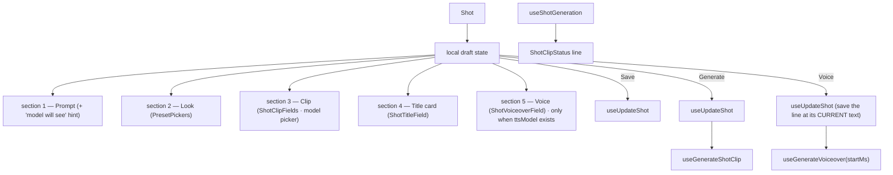

# ShotInspector.tsx — AI component doc

> AI-facing sidecar for `ShotInspector.tsx`. Created 2026-07-09. Keep this in sync with the code on every change.

## Purpose

The selected shot's editor, living in the sticky inspector rail: prompt,
structured preset pickers, video-model picker, duration/transition/title
controls, the spoken line, a live "what the model will see" hint, and the
Save / Generate actions — grouped into five labelled sections instead of one flat
column.

## What it does (for an AI reader)

- Responsibilities: hold the shot draft (keyed by shot.id upstream), persist
  edits, generate+link the clip, and voice the shot's line. Orchestrator only —
  the sub-forms and the status line live in their own files.
- Public API / exports: `ShotInspector`, `ShotInspectorProps`
  (`filmId`, `shot`, `filmAspect`, `videoModels`, `ttsModel`, `startMs`, `isVoiced`).
- Inputs → Outputs: a `Shot` → local draft → `UpdateShotInput` (save), a
  `Generation` (generate), a `FilmAudio` track (voice).
- Side effects: `useUpdateShot`, `useGenerateShotClip`, `useShotGeneration`
  (status line), `useGenerateVoiceover` (charges credits).

## Dependencies

- Imports: `react-i18next`, `applyPromptPreset` + `STYLE_PRESETS` from
  `@opencreate/contracts`, `shared/ui` (`Button`, `Card`), model hooks
  (`useUpdateShot`, `useGenerateShotClip`, `useShotGeneration`,
  `useGenerateVoiceover`), preset helpers, `InspectorSection`, `PresetPickers`,
  `ShotClipFields`, `ShotClipStatus`, `ShotTitleField`, `ShotVoiceoverField`,
  `SparkIcon`.
- Used by: `FilmEditor` (rendered with `key={shot.id}` in the rail; it is also the
  one that computes `startMs` and `isVoiced`).

## Diagram

## Key decisions / gotchas

- v4: a titled glass `Card` (a labelled region) whose controls are grouped into
  four `InspectorSection` fieldsets. The v3 version was one 247-line column with
  no visual boundary between prompt, style, model and title.
- The prompt textarea takes its accessible name from the section legend
  (`aria-label` with the same words) rather than repeating "Prompt" twice.
- The sub-forms (`ShotClipFields`, `ShotTitleField`) and the status line
  (`ShotClipStatus`) are separate files; this one stays at ~190 lines.
- Keyed by `shot.id` upstream → no `useEffect` sync; a new selection re-inits.
- Generate SAVES first (chained via `onSuccess`, no floating async) so the
  composed request is built from persisted edits; generate's own PATCH only sets
  `generationId`.
- The preset stays STRUCTURED to the wire; the hint just previews what the server
  will compose.

## Key decisions (2026-07-11) — template catalog

- **`initialModelId(shot, videoModels)` — which model the picker opens on, in order
  of how much we actually know:** (1) the model the shot is PINNED to
  (`shot.modelId` — a template's tier, or the user's own last pick, now that it is
  persisted); (2) the model its STYLE recommends (`STYLE_PRESETS[styleId]
  .recommendedModelId` — it has existed since the preset tables landed and NOTHING
  read it, so a Disney render defaulted to the fastest, cheapest model); (3) the
  first video model, which is a guess. Before `shot.modelId` existed this function
  was step 3 alone — which is why re-selecting a shot forgot which model produced
  its clip, and a re-Generate could come back on a different model at a different
  price. `buildPatch()` now persists `modelId`.
- **Section 5 (Voice) has its OWN action and its own charge.** Voicing a line is not
  part of generating the picture, and folding it into one button would hide a second
  cost behind the first. The whole section is hidden when the catalog offers no tts
  model.
- **`handleVoice` SAVES the line first, then voices it** (chained through
  `onSuccess`, no floating async). Voicing charges credits against the line the user
  is LOOKING AT — without the save, an edited line would be paid for at its old text.
- **`isVoicing` is separate local state spanning BOTH legs of that chain.** Deriving
  the button's busy state from `voiceover.isPending` alone would leave it live during
  the PATCH, and a double-click there is a double charge. It is reset in `onSettled`
  and `onError`.
- `startMs` and `isVoiced` are computed by `FilmEditor` and passed in — the inspector
  sees one shot, and only the editor knows every shot's duration (for the timeline
  offset) and the film's audio tracks (for the voiced state).

## Commits

- _no commit yet_
