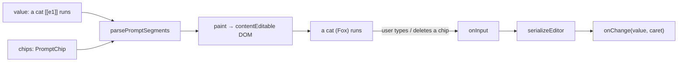

# ShotPromptEditor.tsx — AI component doc

> AI-facing sidecar for `ShotPromptEditor.tsx`. Created 2026-07-28. Keep this in sync with the code on every change.

## Purpose
The rich prompt field for a shot: the value on the wire keeps the opaque `[[eN]]` cast tokens, but the user sees each token as an inline amber chip (photo + name). Built to replace the plain `<textarea>` in `ShotInspector`, which leaks machine syntax into the text the user is writing and lets her edit a token's insides (`[[e11]]`) into a silently broken tag.

## What it does (for an AI reader)
- Responsibilities: render prompt ↔ DOM in both directions, keep chips atomic, report the wire value + caret offset on every input.
- Public API / exports / props / endpoints:
  - `ShotPromptEditor({ value, chips, onChange, placeholder, ariaLabel, className? })` — `onChange(value: string, caret: number)`.
  - `parsePromptSegments(value, chips): PromptSegment[]` — pure, wire string → render plan.
  - `serializeEditor(root: Node): string` — pure, DOM → wire string.
  - Types `PromptChip { placeholder, name, imageUrl }`, `PromptSegment`, `ShotPromptEditorProps`.
- Inputs → Outputs: `value` (`'a cat [[e1]] runs'`) + `chips` → contentEditable DOM with a chip island for `e1`; user edits → `onChange('a cat  runs', caret)`.
- Side effects (I/O, network, state): none beyond the DOM — one `useLayoutEffect` that writes the editor's children imperatively. No fetching, no store.

## Dependencies
- Imports / depends on: `@opencreate/contracts` (`ENTITY_PLACEHOLDER_PATTERN`, `entityPlaceholderToken`) — the ONE definition of the token syntax; `react` (`useLayoutEffect`, `useRef`).
- Used by: nothing yet — the component exists and is tested, but `ShotInspector` still renders its `<textarea>`. Wiring it in is a separate change (the inspector's `handlePromptChange` already takes `(value, caret)`-shaped data from `event.target.selectionStart`, so the swap is mostly mechanical; the mention picker's `onKeyDown`/`onBlur` props are NOT on this component yet).

## Diagram

## Key decisions / gotchas
- **The DOM is painted imperatively, not as React children.** The user's keystrokes mutate this subtree directly, so React must not own it; and a repaint on every keystroke would reset the caret to offset 0. The layout effect repaints ONLY when `serializeEditor(el) !== value` (an edit from outside: enhance, a spliced token, a loaded shot) or when the chip list changed.
- **`paintedChipsRef` exists for a real ordering bug**: entities load after the shot, so the first paint sees `chips: []` and renders `[[e1]]` as literal text. When the chips arrive the value is unchanged, so the serialize-guard alone would leave the token literal forever. The chip key breaks that tie.
- **An unknown token stays literal text** (`[[e9]]` with no matching chip). Inventing a chip would show a character the API will not substitute; dropping it would silently edit the user's prompt.
- **The placeholder key lives in `data-placeholder`, never in text** — that is what keeps `[[e1]]` off screen while `serializeEditor` can still recover it. `serializeEditor` treats ANY element with that attribute as a chip, so do not reuse the attribute name elsewhere inside the editor.
- **Chips are `contentEditable=false` islands**, so the browser's own Backspace deletes one whole or not at all — the atomicity the test simulates by removing the node and firing `input`.
- **The invariant is unchanged from the textarea** (`shared/libs/mentions.ts`): the TEXT is the single source of truth for which tags are live. Deleting a chip drops its token from the value, which drops the ref at submit — no separate bookkeeping.
- **Caret is reported in WIRE coordinates** (counted over `[[eN]]`, not over the rendered label), because that is what `findActiveMention` needs. With no live selection (fresh mount, programmatic input, jsdom) it falls back to end-of-value.
- **Known gaps, deliberate**: no `onPaste` sanitizing (a rich paste puts markup in the DOM; the wire value stays clean because serialization reads only text nodes and chips), and only ` ` maps to `\n` — a block split (`
`/`
`) from some browsers' Enter handling does not.

## Commits
- _no commit yet_
