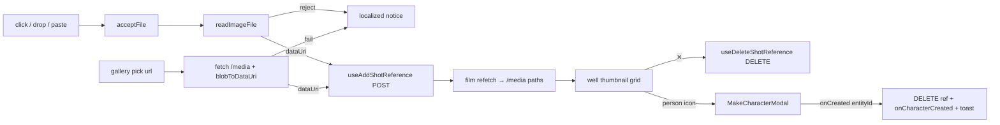

# ShotReferenceImages.tsx — AI component doc

> AI-facing sidecar for `Cinema/components/ShotReferenceImages.tsx`. Created 2026-07-22. Keep this in sync with the code on every change.

## Purpose
Attach ANY image to a shot as a generation reference ("make it look like these"),
via click / drag-drop / paste, OR by picking one of the user's own finished images
("attach from gallery"). Sits alongside `ShotCastField` in the composer's cast
drawer — that control tags a known character, this one attaches an arbitrary
picture — and they share the budget of 5.

## What it does (for an AI reader)
- Responsibilities:
  - FOUR attach sources. Three route a raw File through one `acceptFile` → the
    shared `readImageFile` gate → `useAddShotReference` POST: file picker (click),
    drag-and-drop onto the region, and paste (Cmd/Ctrl+V of a screenshot). The
    fourth, a gallery pick, opens `ShotGalleryPicker`; the chosen `/media` URL is
    fetched → read into a data URI (`blobToDataUri`) → the SAME add POST (it does
    NOT re-run `readImageFile` — the media is already ours and validated).
  - Render attached refs as a removable thumbnail grid in `well` Cards; each ✕
    calls `useDeleteShotReference` by id.
  - Enforce the shared budget of `MAX_SHOT_REFERENCE_IMAGES` (entity tags +
    images): show `N / 5`, hide BOTH the add tile and the gallery tile at the cap.
  - 4 UI states: Loading (a `Skeleton` plate while the upload is in flight),
    Empty (the click/drop/paste hint), Error (client type/size reject, a server
    400, OR a failed gallery fetch — all localized), Data (the thumbnail grid).
    The picker owns its OWN 4 states over the gallery query.
  - MAKE-CHARACTER bridge: each thumbnail also carries a `PersonIcon` button that
    opens `MakeCharacterModal` for that ref. On its `onCreated(entityId)` this
    component runs the shot-level effects: DELETE the raw ref (so the image is not
    sent twice), call `onCharacterCreated(entityId)` (auto-@mention), and toast.
- Public API / props: `{ filmId, shotId, references, entityRefCount, onCharacterCreated }`.
- Endpoints (via hooks): `POST /api/films/:id/shots/:shotId/references`,
  `DELETE /api/films/:id/shots/:shotId/references/:refId`. The gallery source
  reads `GET /api/generations?limit=50` (through `ShotGalleryPicker`). The make-
  character source hits `/api/entities` (through `MakeCharacterModal`).
- Inputs → Outputs: a File (upload gesture) OR a picked `/media` URL → a data URI
  POST → (on refetch) a new thumbnail sourced from the server `/media` path. NOT
  the client data URI.
- Side effects: mutation network calls, a fetch of the picked media, local
  error/drag/picker state; NO document listeners (paste is element-scoped React
  `onPaste`, so nothing leaks).

## Dependencies
- Imports / depends on: `react`, `react-i18next`, `@opencreate/contracts`
  (`MAX_SHOT_REFERENCE_IMAGES`, `ShotReferenceImage`), `shared/libs/apiClient`
  (`ApiClientError`), `shared/libs/blobToDataUri`, `shared/libs/errorCopy`
  (`errorCodeMessageKey`), `shared/libs/readImageFile`, `shared/ui` (`Card`,
  `Skeleton`, `toast`), `../model/shotReferencesApi`, `./MakeCharacterModal`,
  `./ShotGalleryPicker`, and `./icons` (`PersonIcon`).
- Used by: `Cinema/components/ShotInspector.tsx` (mounted in the cast drawer,
  under `ShotCastField`).

## Diagram

## Key decisions / gotchas
- Thumbnail source is the refetched shot's `/media` path, never the client data
  URI — the path is authoritative and is what the model receives at generate time.
  A `Skeleton` covers the in-flight gap.
- Paste is scoped by using React `onPaste` on this focusable (`tabIndex=0`)
  region: it fires only when the area (or a child) is focused, so a Cmd+V into
  the prompt textarea is never hijacked, and there is no global listener to leak.
- The shared budget counts `entityRefCount` (LIVE tags derived in ShotInspector)
  + `references.length`. The frontend hides the add tile at the cap; the API is
  authoritative and a 400 is localized via `errorCodeMessageKey`.
- No cross-module import: `readImageFile` is consumed from `shared/libs` (moved
  there from `modules/Generator`), keeping ONE validation gate.

## Update 2026-07-24 — attach from gallery
- Added a fourth attach source: a "▦" gallery trigger tile (aria-label
  `cinema.shotRef.gallery`) sits next to the "+" tile and is hidden at the cap
  the same way. It opens `ShotGalleryPicker` (rendered only while open, so the
  gallery query is lazy).
- `handlePickFromGallery(url)`: `fetch(url)` → `blob()` → `blobToDataUri` →
  the existing `useAddShotReference` POST. A failed fetch/read reuses the ONE
  localized notice (`cinema.shotRef.galleryError`). No new endpoint, no
  client-trusted URL on the wire.
- New i18n keys (en+ru): `gallery`, `galleryTitle`, `galleryEmpty`,
  `galleryError`, `galleryPick`.
- New sibling files: `ShotGalleryPicker.tsx` (the modal) and
  `model/galleryImagesApi.ts` (`useMyImageGenerations`). Test added:
  "attaches an image picked from the gallery as a data URI POST".

## Update 2026-07-24 — no model-gating copy
- The `modelSupportsReferences` prop and the `cinema.shotRef.modelHint` notice
  ("this model doesn't use reference images — switch to Wan 2.7") are GONE (owner
  request: never show such copy). Attaching is always offered; whether the refs
  reach the provider is `composeShotClipInput`'s call (it drops them silently, no
  charge, for a model without `referenceMode`). The `shotRef.modelHint` locale key
  was deleted from en+ru. Test updated: it now asserts the nag is ABSENT.

## Update 2026-07-24 — make a character from an attached reference
- Each attached thumbnail now carries a `PersonIcon` button (aria-label
  `cinema.shotRef.makeCharacter`) on its bottom-left corner — always offered,
  budget-neutral (a raw ref becomes a tag). It opens `MakeCharacterModal`.
- On the modal's `onCreated(entityId)`: `useDeleteShotReference` drops the raw ref
  (the image would otherwise be sent twice — anonymously AND as the character's
  photo), the new required prop `onCharacterCreated(entityId)` auto-@mentions it in
  the prompt, and `toast.success(cinema.shotRef.makeCharacterDone)` confirms.
- New required prop `onCharacterCreated` — `ShotInspector` wires it to
  `addCharacter`. New sibling files: `MakeCharacterModal.tsx` + `model/
  makeCharacterApi.ts`. The `blobToDataUri` helper moved to `shared/libs`.
- New i18n keys (en+ru): `makeCharacter`, `makeCharacterModalTitle`,
  `makeCharacterNamePlaceholder`, `makeCharacterSubmit`, `makeCharacterDone`,
  `makeCharacterError`. Test added: "turns an attached reference into a named
  character and auto-tags it".

## Commits
- _no commit yet_
