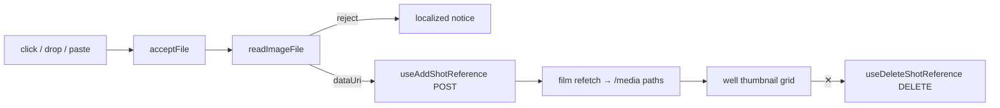

# ShotReferenceImages.tsx — AI component doc

> AI-facing sidecar for `Cinema/components/ShotReferenceImages.tsx`. Created 2026-07-22. Keep this in sync with the code on every change.

## Purpose
Attach ANY image to a shot as a generation reference ("make it look like these"),
via click / drag-drop / paste. Sits alongside `ShotCastField` in the composer's
cast drawer — that control tags a known character, this one attaches an arbitrary
picture — and they share the budget of 5.

## What it does (for an AI reader)
- Responsibilities:
  - Three input gestures — file picker (click), drag-and-drop onto the region,
    and paste (Cmd/Ctrl+V of a screenshot) — all funnel through one `acceptFile`
    → the shared `readImageFile` gate → `useAddShotReference` POST.
  - Render attached refs as a removable thumbnail grid in `well` Cards; each ✕
    calls `useDeleteShotReference` by id.
  - Enforce the shared budget of `MAX_SHOT_REFERENCE_IMAGES` (entity tags +
    images): show `N / 5`, hide the add tile at the cap.
  - 4 UI states: Loading (a `Skeleton` plate while the upload is in flight),
    Empty (the click/drop/paste hint), Error (client type/size reject OR a server
    400, both localized), Data (the thumbnail grid).
  - Honest capability note when the model lacks `referenceMode`: attaching stays
    allowed, with a calm "switch to Wan 2.7" line (not the character-centric block).
- Public API / props: `{ filmId, shotId, references, entityRefCount, modelSupportsReferences }`.
- Endpoints (via hooks): `POST /api/films/:id/shots/:shotId/references`,
  `DELETE /api/films/:id/shots/:shotId/references/:refId`.
- Inputs → Outputs: a File (any gesture) → a data URI POST → (on refetch) a new
  thumbnail sourced from the server `/media` path. NOT the client data URI.
- Side effects: mutation network calls + local error/drag state; NO document
  listeners (paste is element-scoped React `onPaste`, so nothing leaks).

## Dependencies
- Imports / depends on: `react`, `react-i18next`, `@opencreate/contracts`
  (`MAX_SHOT_REFERENCE_IMAGES`, `ShotReferenceImage`), `shared/libs/apiClient`
  (`ApiClientError`), `shared/libs/errorCopy` (`errorCodeMessageKey`),
  `shared/libs/readImageFile`, `shared/ui` (`Card`, `Skeleton`), and
  `../model/shotReferencesApi`.
- Used by: `Cinema/components/ShotInspector.tsx` (mounted in the cast drawer,
  under `ShotCastField`).

## Diagram

## Key decisions / gotchas
- Thumbnail source is the refetched shot's `/media` path, never the client data
  URI — the path is authoritative and is what the model receives at generate time.
  A `Skeleton` covers the in-flight gap.
- Paste is scoped by using React `onPaste` on this focusable (`tabIndex=0`)
  region: it fires only when the area (or a child) is focused, so a Cmd+V into
  the prompt textarea is never hijacked, and there is no global listener to leak.
- The shared budget counts `entityRefCount` (LIVE tags derived in ShotInspector)
  + `references.length`. The frontend hides the add tile at the cap; the API is
  authoritative and a 400 is localized via `errorCodeMessageKey`.
- No cross-module import: `readImageFile` is consumed from `shared/libs` (moved
  there from `modules/Generator`), keeping ONE validation gate.

## Commits
- _no commit yet_
