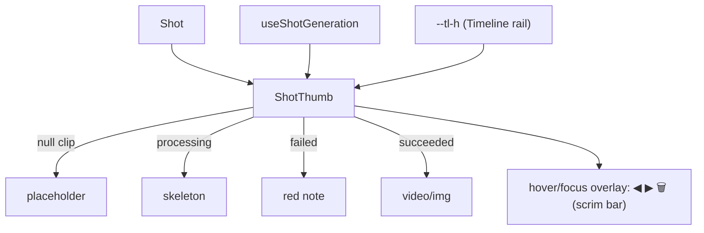

# ShotThumb.tsx — AI component doc

> AI-facing sidecar for `ShotThumb.tsx`. Created 2026-07-09. Keep this in sync with the code on every change.

## Purpose

One shot on the timeline strip: a 16:9 tile that reflects its clip's LIVE
status (shared `['generation', id]` cache). Sized by the rail's `--tl-h`
custom property (v6 resizable strip); the move/delete cluster is a hover/focus
overlay on the tile's bottom edge.

## What it does (for an AI reader)

- Responsibilities: render a shot's tile (4 lifecycle states) + the reveal-on-
  hover reorder/delete overlay.
- Public API / exports: `ShotThumb`, `ShotThumbProps` (`shot`, `index`,
  `isSelected`, `onSelect`, `onMoveLeft/Right`, `onDelete`, `canMoveLeft/Right`).
- Inputs → Outputs: a `Shot` + handlers → an interactive tile. Height =
  `h-[var(--tl-h,64px)]` (the rail `<ul>` publishes the var), width follows via
  `aspect-video` — no fixed width of its own since v6.
- Side effects: `useShotGeneration(shot.generationId)` (read-only poll here).

## Dependencies

- Imports: `react-i18next`, `shared/ui` (`Badge`, `Skeleton`),
  `useShotGeneration`, icons.
- Used by: `Timeline` (which owns `--tl-h`).

## Diagram

## Key decisions / gotchas

- Status is never color-only: failed shows text, ready shows the media, the title
  is a text Badge.
- The tile is the select target (`aria-pressed`); move buttons disable at the
  strip ends.
- **v6 hover overlay:** the cluster is revealed by `group-hover` /
  `group-focus-within` and its `pointer-events` are gated WITH the opacity — an
  invisible Delete must never intercept a click aimed at the tile. The buttons
  stay in the DOM permanently, so Tab and screen readers always reach them
  (focusing one reveals the bar). They are SIBLINGS of the tile button,
  absolutely positioned over it — nesting buttons is invalid HTML.
- **v6 chip shuffle:** duration moved to the tile's top-right (the bottom edge
  belongs to the overlay), the title Badge moved INSIDE the tile (bottom-left,
  `pointer-events-none`) — a text row under a variable-height tile made the
  strip ragged.

## Update 2026-07-15 — v5 compact thumb
- Tile w-40→w-28; superseded by v6 (same day): fixed width replaced by the
  `--tl-h`-driven height, controls row replaced by the hover overlay.

## Update 2026-07-15 — overlay pointer-events fix
- The scrim BAR no longer takes pointer events at all; each button re-enables
  its own (`pointer-events-none` base + `group-hover/group-focus-within:auto`).
  Found live: the revealed bar swallowed clicks aimed at the tile's bottom
  third, so selecting a shot by its lower half silently did nothing.

## Update 2026-07-16 — v7 proportional slot
- Width now comes from the PARENT SLOT (`w-full`): on the tracks timeline a
  slot is as wide as its clip is long, so the tile fills it and the media
  crops (object-cover) — a timeline tile is a strip of footage, not a framed
  thumbnail. The aspect-video derivation is gone.

## Commits

- _no commit yet_
