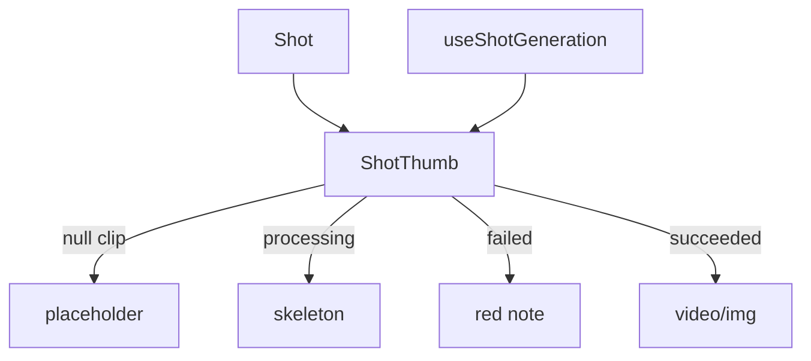

# ShotThumb.tsx — AI component doc

> AI-facing sidecar for `ShotThumb.tsx`. Created 2026-07-09. Keep this in sync with the code on every change.

## Purpose

One shot on the timeline strip: a fixed-width 16:9 tile that reflects its clip's
LIVE status (shared `['generation', id]` cache) plus the move/delete cluster.

## What it does (for an AI reader)

- Responsibilities: render a shot's tile (4 lifecycle states) + reorder/delete controls.
- Public API / exports: `ShotThumb`, `ShotThumbProps` (`shot`, `index`,
  `isSelected`, `onSelect`, `onMoveLeft/Right`, `onDelete`, `canMoveLeft/Right`).
- Inputs → Outputs: a `Shot` + handlers → an interactive tile.
- Side effects: `useShotGeneration(shot.generationId)` (read-only poll here).

## Dependencies

- Imports: `react-i18next`, `shared/ui` (`Badge`, `Skeleton`),
  `useShotGeneration`, icons.
- Used by: `Timeline`.

## Diagram

## Key decisions / gotchas

- Status is never color-only: failed shows text, ready shows the media, the title
  is a text Badge.
- The tile is the select target (`aria-pressed`); move buttons disable at the
  strip ends.

## Commits

- _no commit yet_
