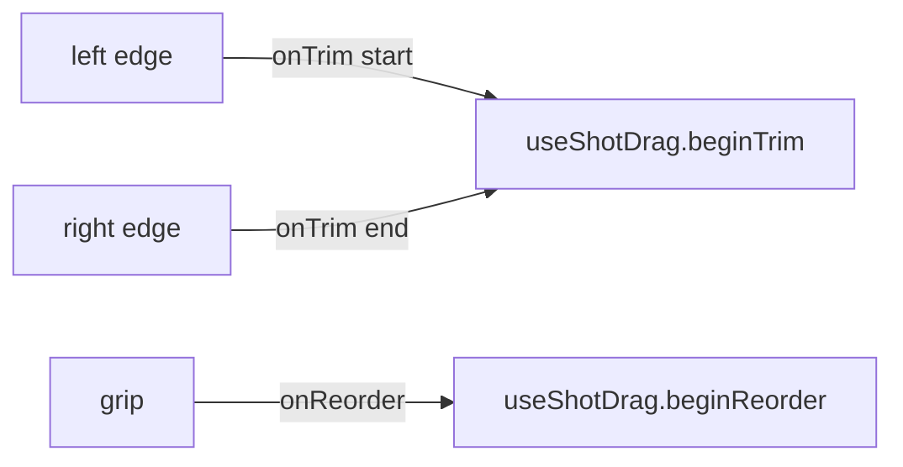

# ShotTileAffordances.tsx — AI component doc

> AI-facing sidecar for `ShotTileAffordances.tsx`. Created 2026-07-22 (NLE Phase 3). Keep in sync with the code on every change.

## Purpose

The Phase-3 drag affordances that ride ON a timeline tile: two TRIM edges (left =
in-point, right = out-point) and a REORDER grip. Siblings of `ShotThumb` inside the
lane `<li>`, so `ShotThumb` stays untouched and the tile centre remains the select
target. Presentational only — the drag session + commit live in `useShotDrag`.

## What it does (for an AI reader)

- Responsibilities: render the three hover/focus-revealed drag handles; forward
  their pointerdown to the hook.
- Public API / exports: `ShotTileAffordances`, `ShotTileAffordancesProps =
  { index, onTrim(edge, event), onReorder(event) }`.
- Inputs → Outputs: a pointerdown on a handle → `onTrim`/`onReorder` (the hook
  begins the drag). No state of its own.
- Side effects: none (the hook owns listeners + mutations).

## Dependencies

- Imports: `react-i18next`, `react` type `PointerEvent`, `TrimEdge` from
  `../model/useShotDrag`.
- Used by: `Timeline` (rendered per tile inside the `group relative` `<li>`,
  after `ShotThumb`).

## Diagram

## Key decisions / gotchas

- **Siblings, not part of `ShotThumb`** — keeps `ShotThumb` untouched and the tile
  centre selectable; the handles sit `z-20` over the tile edges/top.
- **Hover/focus-revealed** — the strip is pure footage at rest (the ShotThumb
  overlay contract). The lane `<li>` is the `group` these read.
- **Pointer-drag only** — keyboard reorder stays on ShotThumb's chevrons; keyboard
  trim is a documented Phase-4 gap. Handles are still focusable `<button>`s with
  per-shot `aria-label`s (named by index, not "trim" twelve times).
- **No gradients / tokens only** — trim edge tints `bg-portal/40`, grip on a
  `bg-void` scrim, inner bars `bg-white/*`.

## Commits

- _no commit yet_
